# Connection

## What is a connection?

If there can be a **Flow** between two or more **Elements**, then there is a **Connection**.

A **Flow** can be of:

- a fluid, such as water or natural gas;
- energy, such as heat or electricity;
- signal conveying information;
- discrete entities, such as people, goods on pallets, or vehicles;
- mechanical load.

A **Connection** can be between **States** or **Events**.

A **Connection** requires that the connected **Elements** touch or overlap, or rely upon some "less significant" intermediate **Elements** between them. What is "less significant" depends upon context. In Figure 3, the intermediate **Elements** are labelled as "connection material".

Three types of **Connection** are shown schematically in Figure 1, Figure 2 and Figure 3.

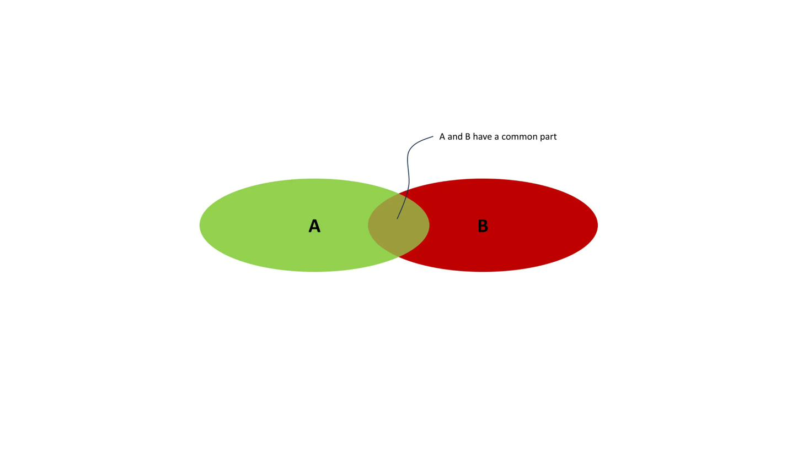

*Figure 1 -- Connection as overlap*

*Figure 2 -- Connection as common boundary*

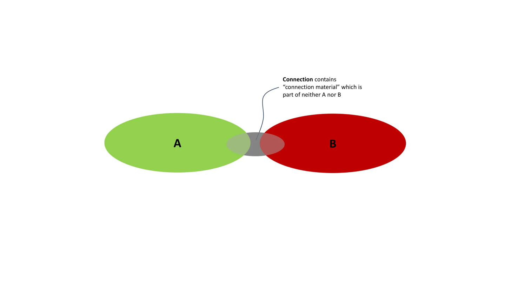

*Figure 3 -- Connection with intermediate Elements*

Where an **Element** is connected, a part of that **Element** that is also part of the **Connection** is a **ConnectionSide**. A **Connection** has two or more instances of **ConnectionSide** as parts. A **ConnectionSide** is a role that is played by a **Connector**.

A **Connector** is a part of an **Element** that is, or is intended to be, all or part of a **ConnectionSide**. A **Connector** can have **States** in which it is a **ConnectionSide**, and states when it is not.

## Connection in IES

The cases shown in Figure 1 and Figure 2 are recorded in IES as shown in Figure 4.

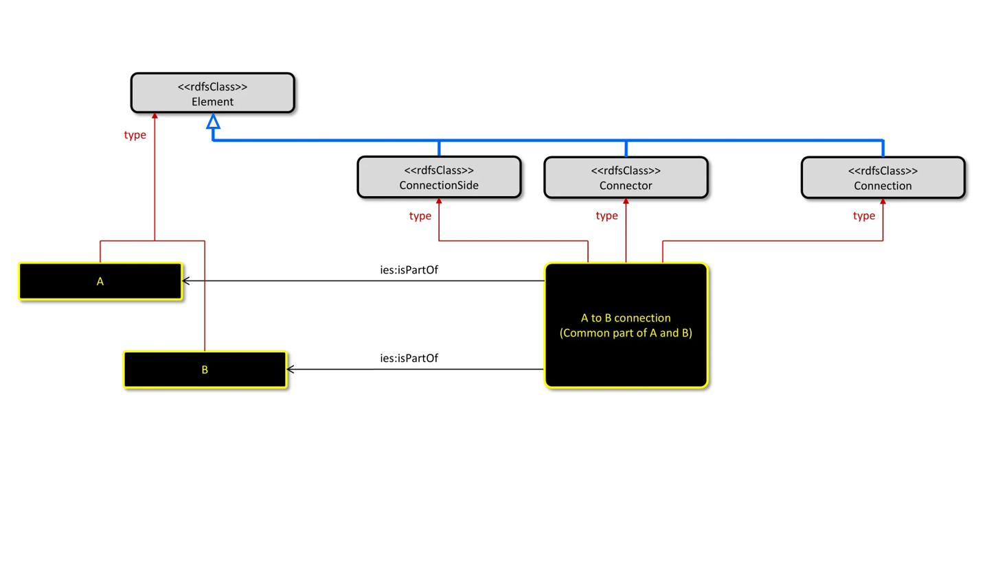

*Figure 4 - Record of connection with overlap*

The case shown in Figure 3 is recorded in IES as shown in Figure 5.

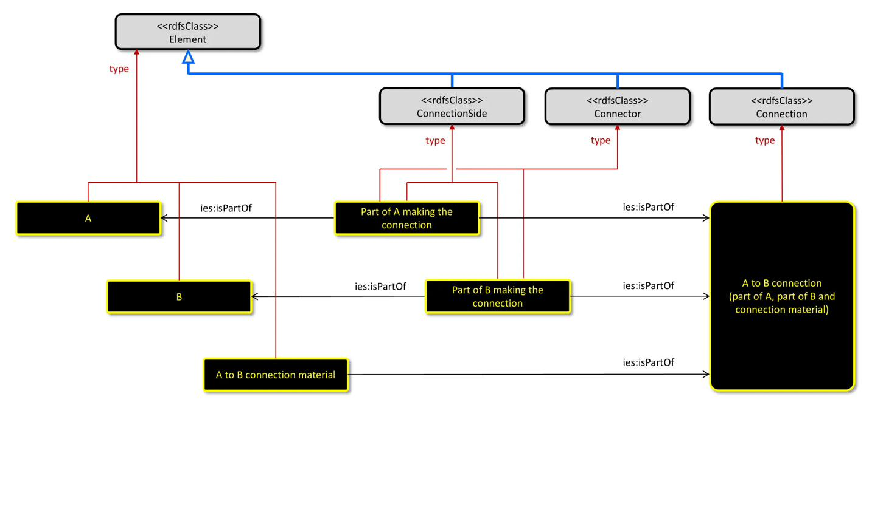

*Figure 5 - Record of connection with intermediate Elements*

## Engineering connection examples

Consider the **Connection** between laptop L and mouse M. Laptop L has a **Connector** which is a USB 2.0 A female port. Mouse M has a **Connector** which is a USB 2.0 A male port. Both of these **Connectors** are states of components which existed before they were part of the laptop or mouse/cable assemblies.

On 2025-03-17, the **Connectors** are two **ConnectionSides** in a **Connection** such that:

- the laptop USB port is the destination of signal from the mouse and the source for power to the mouse;
- the mouse USB port is the source of signal to the laptop and the destination of power from the laptop.

The classifications of the **Connection**, the two instances of **Connector**, and of the two **ConnectionSide** roles that that **Connectors** play in the **Connection**, are shown in Figure 6.

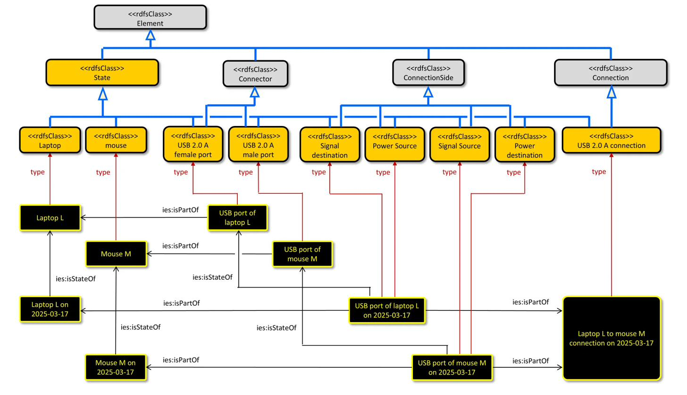

*Figure 6 - Laptop to mouse USB connection*

Consider the bolted flange **Connection** between pipe A end 2 and pipe B end 1 shown in Figure 7.

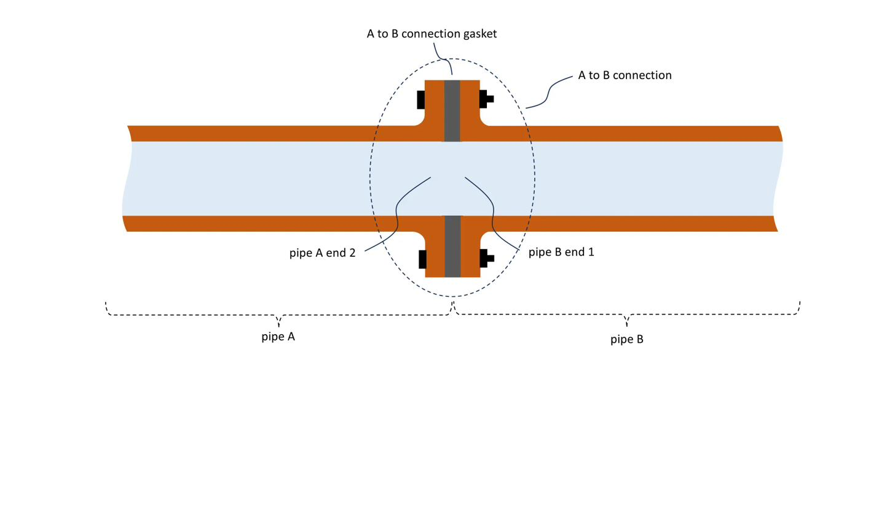

*Figure 7 -- Bolted flange connection*

The **Connection** consists of the flanges at the ends of the pipes, the bolts and the gasket. Pipe A does not touch or overlap with pipe B. This is the approach to **Connection** shown in Figure 3, where there are intermediate **Elements**. A record of the bolted flange connection using IES is shown in Figure 8.

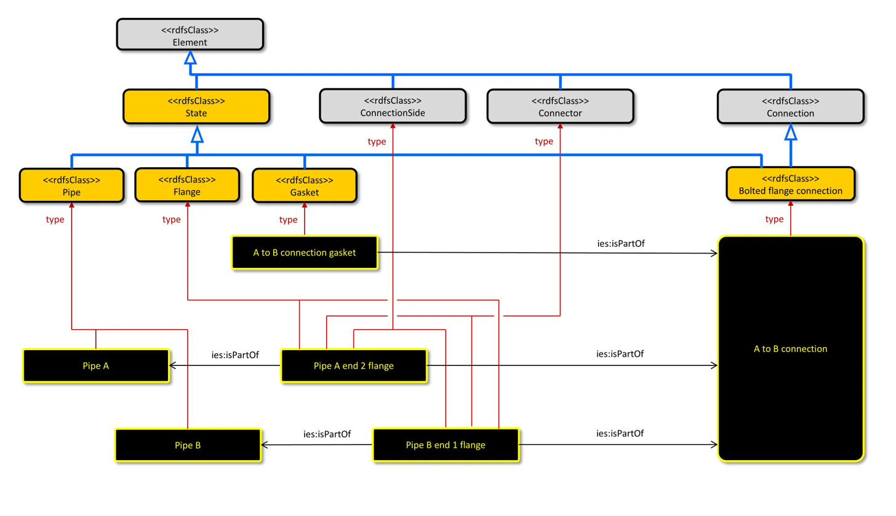

*Figure 8 - Record of a bolted flange connection*

Consider the welded **Connection** between pipe A end 2 and pipe B end 1 shown in Figure 9.

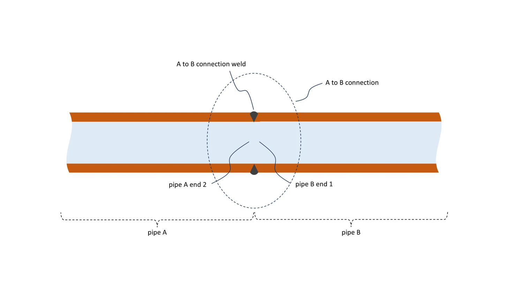

*Figure 9 -- Welded connection*

This **Connection** can be considered as an assembly as in Figure 7, where in this case the assembly consists of the bevelled ends pipe A end 2 and pipe B end 1, and the weld material. A record of the welded connection using IES is shown in Figure 10.

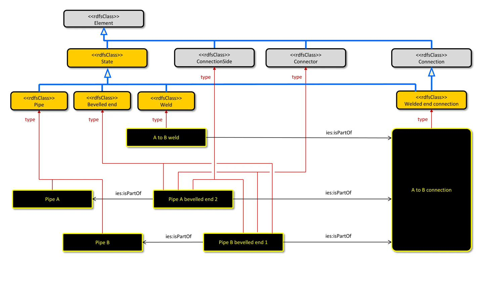

*Figure 10 - Record of a welded connection*

Alternatively this **Connection** can be split into two **Connections**:

- pipe A end 2 is connected to the weld material by a common boundary;
- pipe B end 1 is connected to the weld material by a common boundary.

These are **Connections** with common boundaries as shown in Figure 2.

Consider the discharge **Connection** into a tank shown in Figure 11

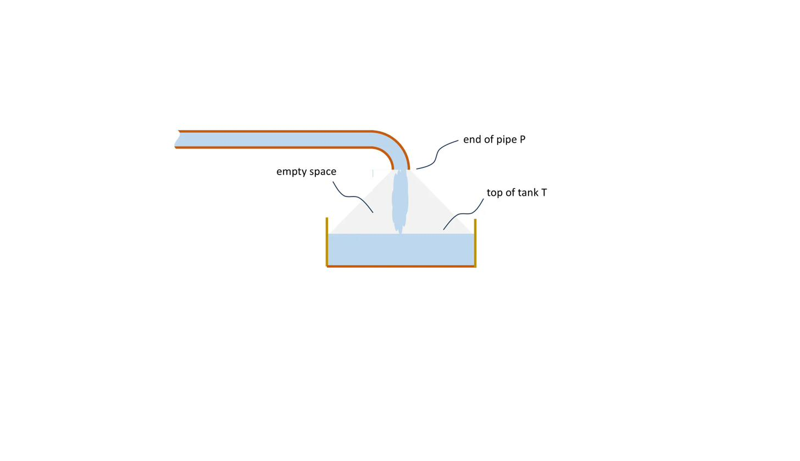

*Figure 11 - Discharge into tank connection*

The empty space can be recorded if required. This is shown in Figure 12.

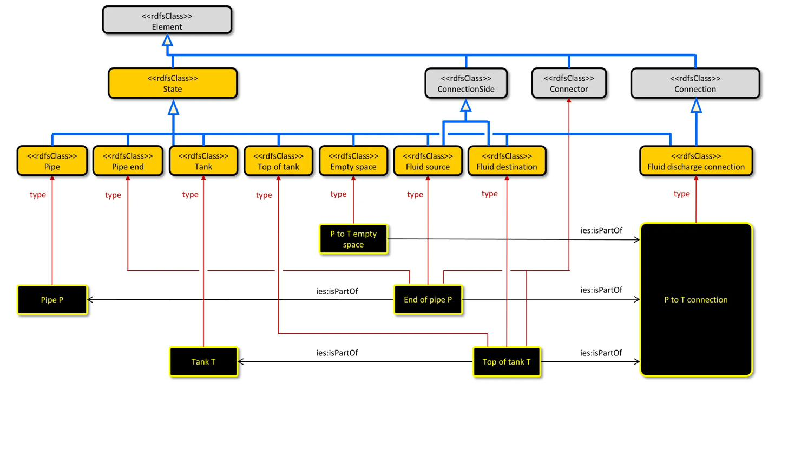

*Figure 12 - Record of discharge into tank connection*

An empty space, through which material or radiation can pass, is often an essential part of a connection. A connection can be lost if the empty space is obstructed.

## Connection as a node

Where the connected elements have two ends, and can be connected at the ends, **Nodes** provide a simplified way of recording **Connections**. A **Node** is whatever exists at an end and encompasses all or part of one or more **Connectors**, and a **Connection** if there is one.

A **Node** can be recorded, where the details of the **Connectors** not known or not important. This is shown in Figure 13.

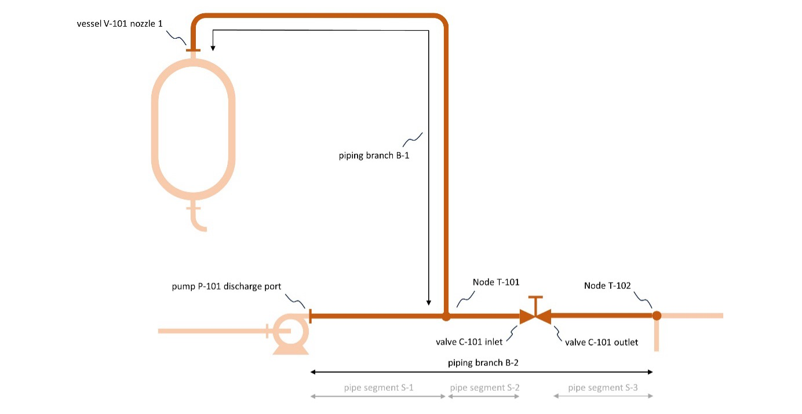

*Figure 13 -- Node in a pipe network*

Piping branch B-1 is connected to piping branch B-2 at pipe **Node** T-101. **Node** T-101 has a **ConnectionSide** which is part of piping branch B-1. **Node** T-101 also has **ConnectionSides** which are parts of piping segments S-1 and S-2. These **ConnectionSides** are not recorded.

## Connections on maps

A road network can be divided into road polygons as shown in Figure 14.

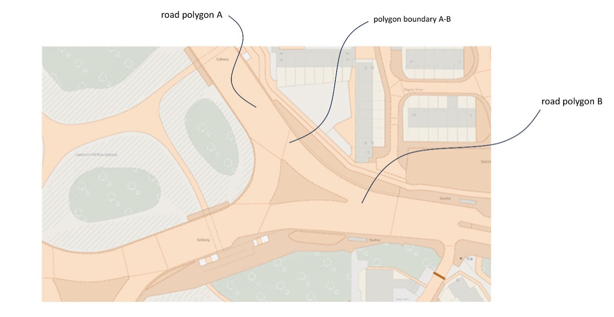

*Figure 14 -- Road network as road polygons*

The road polygons are shown in light brown, with darker brown boundaries. Road polygons are connected if and only if they have a common boundary. The boundaries of the polygons are usually not significant and can be arbitrary. They are usually not displayed on a map.

Because a section of road can be regarded as a connected element with two ends, a **Connection** can be recorded as a **Node**, as shown in Figure 15.

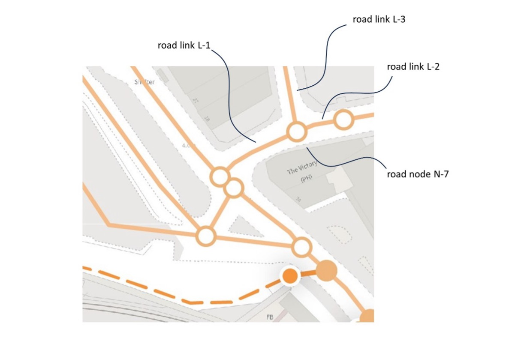

*Figure 15 -- Road network as Nodes and Links*

Each section of road us recorded as a **Link**. In Figure 15, the **Nodes** and **Links** are shown superimposed on the physical roads (white). A road **Node** is at the end of one or more road **Links**.

The **Links** are shown as approximate centre-line curves for the roads, and the **Nodes** are shown approximately in the middle of junctions. The **Links** and **Nodes** are defined by the Ordnance Survey Master Map Highways.

The physical extent of the road associated with a road **Link** is derived by intersections between the nominal centre-line curve and the road topographic area polygons.

A table of cross references is maintained between road **Links** and road polygons is published by OS. Document "OS Open Linked Identifiers -- Technical Specification" (https://www.ordnancesurvey.co.uk/documents/product-support/tech-spec/OS-Open-Linked-Identifiers-Tech-Spec-V1.1.pdf), which says:

> **RoadLink_TOID_TopographicArea_TOID_2**: This relationship is determined by a line in a polygon intersection between the RoadLink centre line geometry and the TopographicArea polygon(s). Specifications of capture can vary between the two source products, therefore not every RoadLink in OS MasterMap Highways Network will be represented by a TopographicArea.

A record of the connection between two road polygons, as shown in Figure 14, is shown in Figure 16.

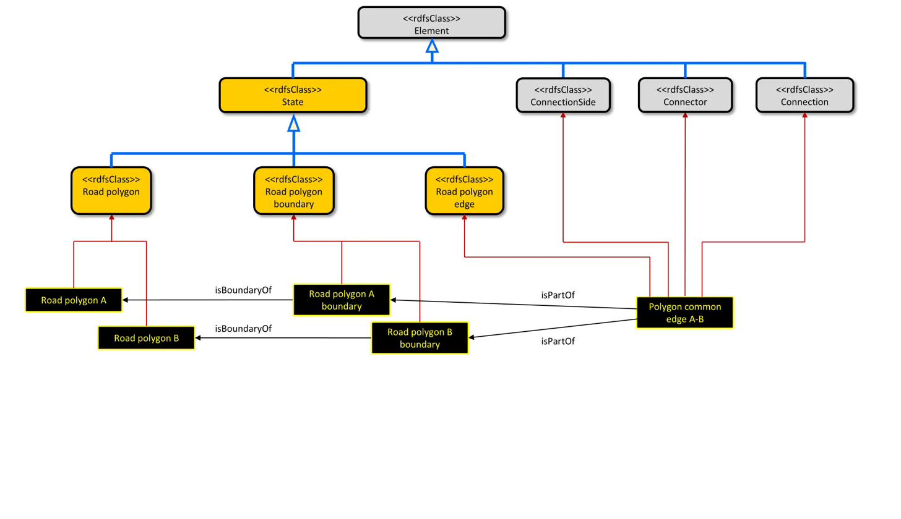

*Figure 16 -- Record of a connection between road polygons*

The classes Road polygon, Road polygon boundary, and Road polygon edge have been defined for this example and are not intended to conflict with the IES extension for geometry.

NOTE The **isBoundaryOf** relationship shown in Figure 16 is not defined in the Connection extension to IES, but is in the scope of geometry.

A record of the road links which are connected at **Node** N-7 in Figure 15 is shown in Figure 17.

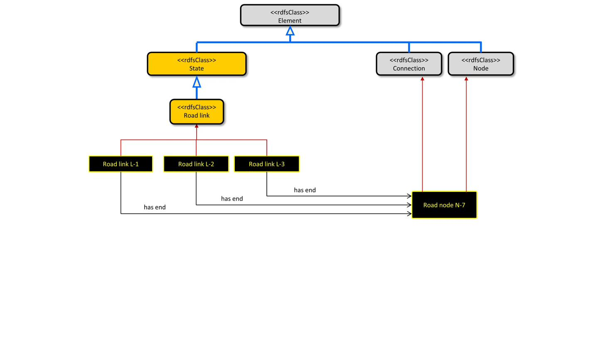

*Figure 17 -- Record of road links between nodes*

The network extension to IES defines the classes **Node** and **Link**, and the relationship has end.
