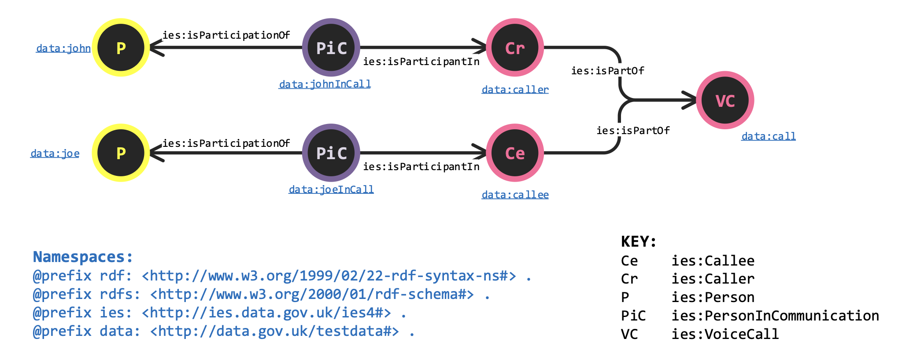
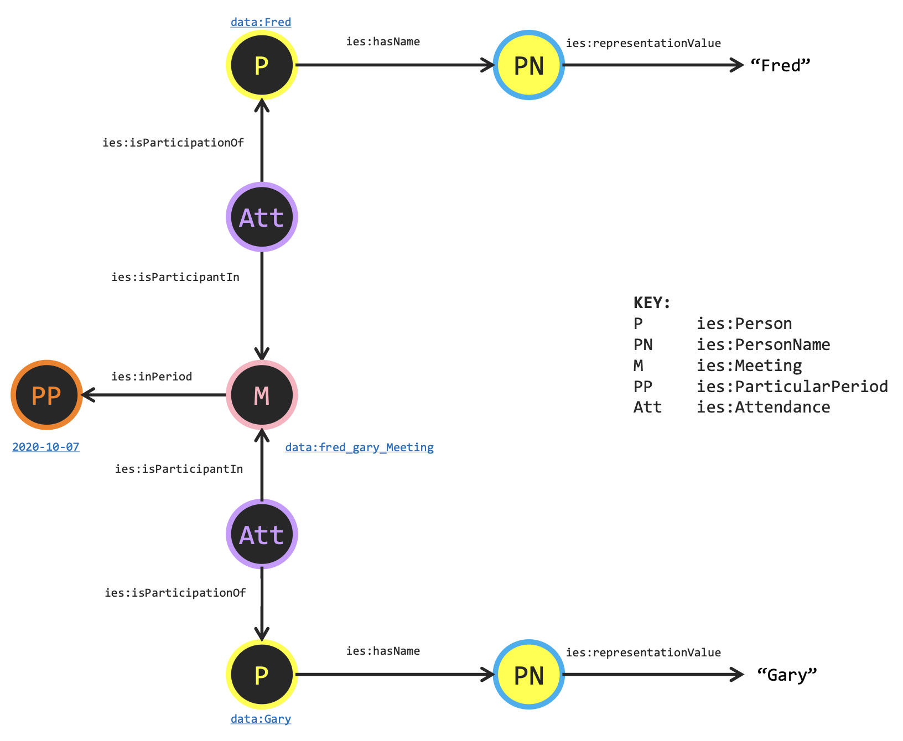
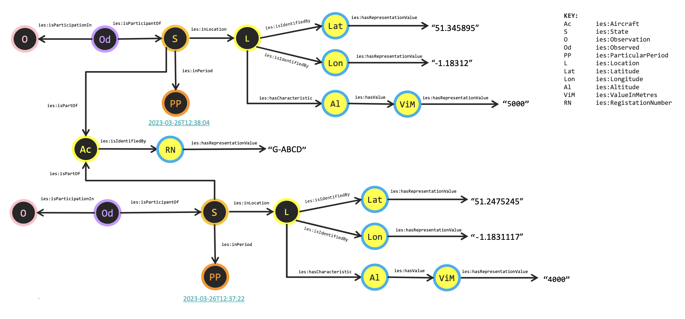
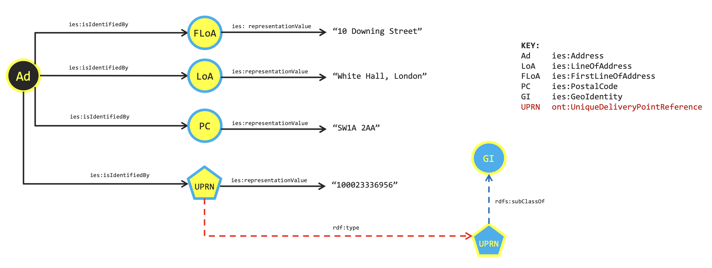
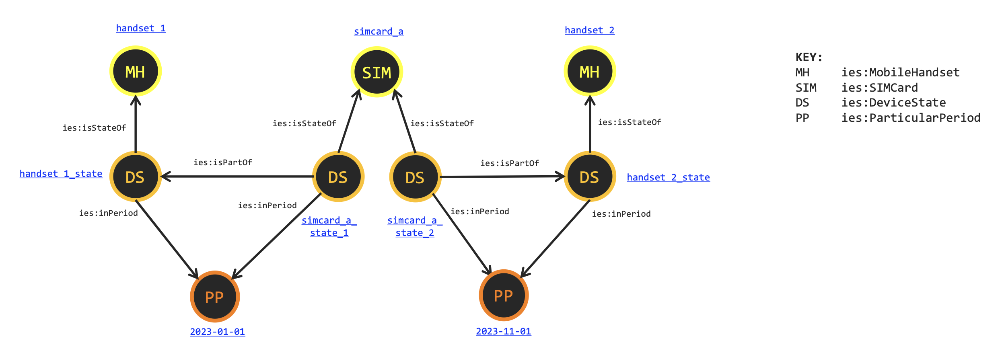
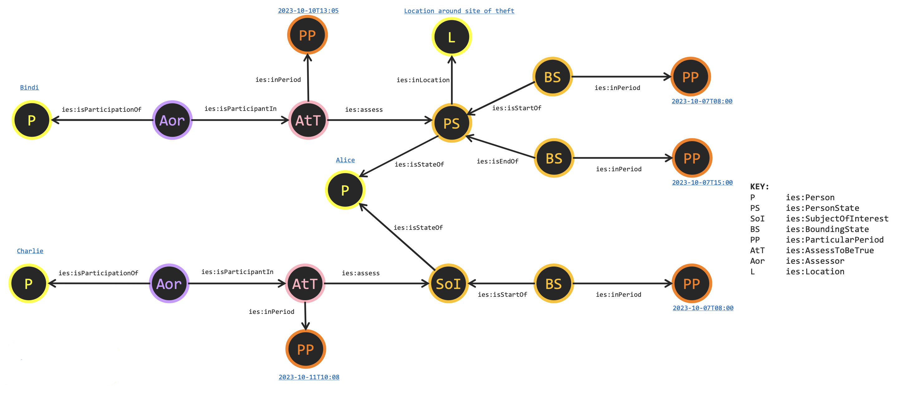
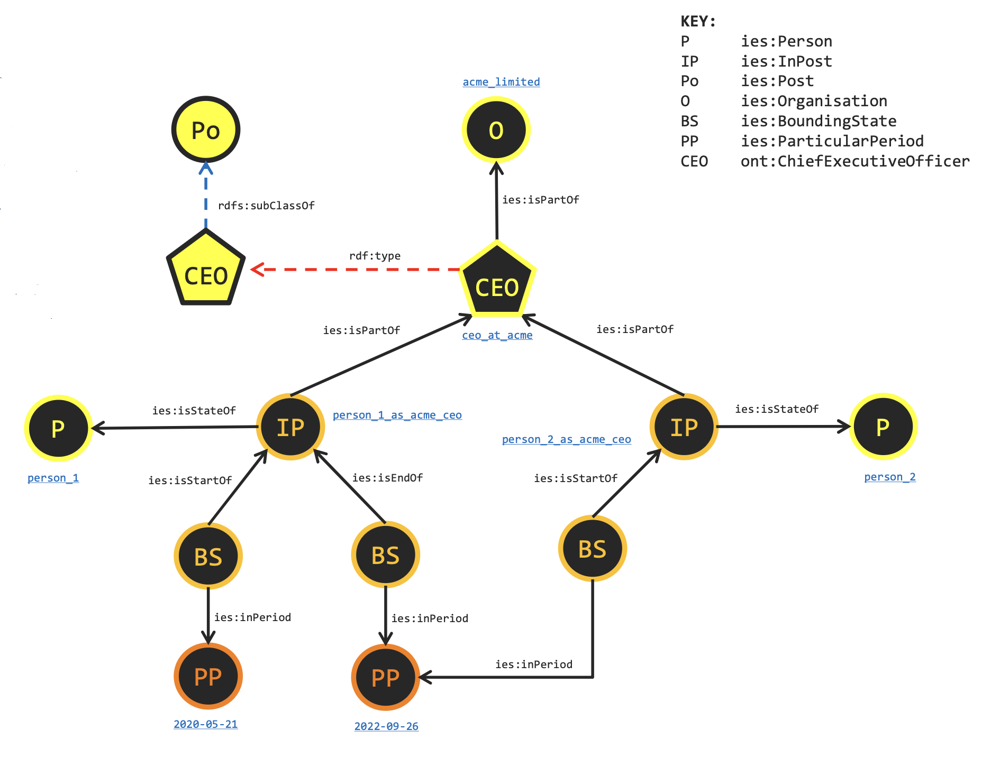
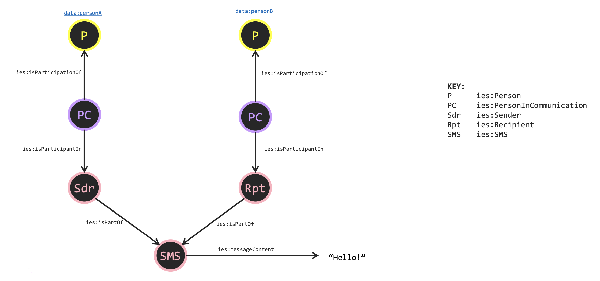
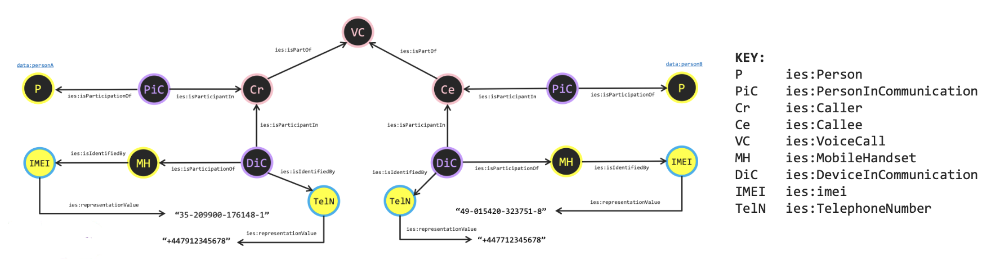
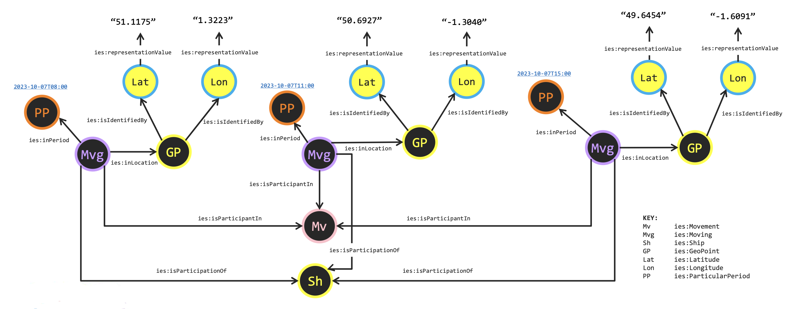

# IES Examples

**Based on version 5.0.1**

This document provides a collection of worked examples demonstrating how to model various scenarios using the Information Exchange Standard (IES). Each example includes both a visual diagram and the corresponding RDF triples in Turtle syntax.

## Contents

1. [A Meeting](#1-a-meeting)
2. [Observations of a Moving Aircraft](#2-observations-of-a-moving-aircraft)
3. [Representations of an Address](#3-representations-of-an-address)
4. [SIM Card Swap in a Mobile Handset](#4-sim-card-swap-in-a-mobile-handset)
5. [Assessments and Subject of Interest](#5-assessments-and-subject-of-interest)
6. [Posts of Organisations](#6-posts-of-organisations)
7. [SMS Message](#7-sms-message)
8. [Voice Call](#8-voice-call)
9. [Movement](#9-movement)

---

## Notation

Throughout the following examples we use a commonly used IES graphical notation. An example of such is
shown below. All IES instances are shown as circular nodes where their type is indicated by an
abbreviation. Pentagonal nodes are used for local ontology extensions to IES. A key is provided for these
abbreviations on each diagram. The colour coding from the IES model is carried through to these diagrams –
e.g. yellow indicated Entity. If the node has its IES colour as the fill-colour, then this represents a
class. If its IES colour is that of the border, it represents an instance. In some examples we provide a
descriptive label for the instance using blue, underlined text.



## 1. A Meeting

### Overview

In this example we have a meeting involving two persons. When entities like a person participate in events, that participation is a special form of State called EventParticipant. Attendance here is a subtype of EventParticipant. The pattern used here is a common one seen across multiple types of event.

### Diagram



**Key:**
- P: `ies:Person`
- PN: `ies:PersonName`
- M: `ies:Meeting`
- PP: `ies:ParticularPeriod`
- Att: `ies:Attendance`

### Description

The diagram shows:
- Two persons (Fred and Gary) each with their names
- Each person has an Attendance state that participates in the meeting
- The meeting occurs on a particular date (2020-10-07)
- The `ies:hasName` relationship links persons to their names
- The `ies:isParticipationOf` relationship links the attendance to the person
- The `ies:isParticipantIn` relationship links the attendance to the meeting
- The `ies:inPeriod` relationship links the meeting to its time

### RDF Triples

```turtle
@prefix ies: <http://informationexchangestandard.org/ont/ies/common/> .
@prefix xsd: <http://www.w3.org/2001/XMLSchema#> .
@prefix iso8601: <http://iso.org/iso8601#> .
@prefix data: <http://example.com/local-data#> .

data:Fred a ies:Person;
    ies:hasName data:FredName .

data:FredName a ies:PersonName;
    ies:representationValue "Fred"^^xsd:string .

data:Gary a ies:Person;
    ies:hasName data:GaryName .

data:GaryName a ies:PersonName;
    ies:representationValue "Gary"^^xsd:string .

data:FredAttendance a ies:Attendance;
    ies:isParticipationOf data:Fred;
    ies:isParticipantIn data:FredGaryMeeting .

data:GaryAttendance a ies:Attendance;
    ies:isParticipationOf data:Gary;
    ies:isParticipantIn data:FredGaryMeeting .

data:FredGaryMeeting a ies:Meeting;
    ies:inPeriod iso8601:20301007.

iso8601:20301007 a ies:ParticularPeriod;
    ies:iso8601PeriodRepresentation "2030-10-07"^^xsd:string .
```

---

## 2. Observations of a Moving Aircraft

### Overview

In this example we have two observations of an aircraft moving through the air. Note how these are observations of different states of that aircraft in different positions in the air and at different altitudes.

### Diagram



**Key:**
- Ac: `ies:Aircraft`
- S: `ies:State`
- O: `ies:Observation`
- Od: `ies:Observed`
- PP: `ies:ParticularPeriod`
- L: `ies:Location`
- Lat: `ies:Latitude`
- Lon: `ies:Longitude`
- Al: `ies:Altitude`
- ViM: `ies:ValueInMetres`
- RN: `ies:RegistrationNumber`

### Description

The aircraft is identified by its registration number "G-ABCD". Two separate observations capture the aircraft at different times and locations:

**First Observation (2023-03-26T12:37:22):**
- Location: Latitude 51.345895, Longitude -1.18312
- Altitude: 5000 metres

**Second Observation (2023-03-26T12:38:04):**
- Location: Latitude 51.2475245, Longitude -1.1831117
- Altitude: 4000 metres

Each observation is an event that has a participant state (Observed) which is itself part of the overall state of the aircraft. The aircraft's location and altitude characteristics are captured at each observation point.

---

## 3. Representations of an Address

### Overview

In this example we demonstrate how to assign address information to a location. Here we have 10 Downing Street with some traditional address information: lines of address and postcode. Here we utilise existing geo identifier classes in IES. This example also demonstrates using an extension of IES to articulate the UPRN of this address.

UPRNs (Unique Delivery Point References) are unique identifiers for addressable locations in the UK. Notice how the class UPRN (shown as a blue filled pentagon in the diagram) is an extension of the existing `ies:GeoIdentity` class found in IES.

### Diagram



**Key:**
- Ad: `ies:Address`
- LoA: `ies:LineOfAddress`
- FLoA: `ies:FirstLineOfAddress`
- PC: `ies:PostalCode`
- GI: `ies:GeoIdentity`
- UPRN: `ont:UniqueDeliveryPointReference` (extension class)

### Description

The address (10 Downing Street) is identified by multiple representations:
- First line of address: "10 Downing Street"
- Line of address: "White Hall, London"
- Postal code: "SW1A 2AA"
- UPRN: "100023336956" (using an extended class)

The UPRN class is defined as a subclass of `ies:GeoIdentity`, demonstrating how IES can be extended to accommodate domain-specific identifiers.

### RDF Triples

```turtle
@prefix ies: <http://informationexchangestandard.org/ont/ies/common/> .
@prefix iso8601: <http://iso.org/iso8601#> .
@prefix rdfs: <http://www.w3.org/2000/01/rdf-schema#> .
@prefix xsd: <http://www.w3.org/2001/XMLSchema#> .
@prefix ont: <http://example.com/local-ontology#> .
@prefix data: <http://example.com/local-data#> .

ont:UniqueDeliveryPointReference rdfs:subClassOf ies:GeoIdentity .

data:10DowningStreet a ies:Address;
    ies:isIdentifiedBy data:10DowningStreetFLoA;
    ies:isIdentifiedBy data:10DowningStreetLoA;
    ies:isIdentifiedBy data:10DowningStreetPC;
    ies:isIdentifiedBy data:10DowningStreetUDPR .

data:10DowningStreetFLoA a ies:FirstLineOfAddress;
    ies:representationValue "10 Downing Street"^^xsd:string .

data:10DowningStreetLoA a ies:LineOfAddress;
    ies:representationValue "White Hall, London"^^xsd:string .

data:10DowningStreetPC a ies:PostalCode;
    ies:representationValue "SW1A 2AA"^^xsd:string .

data:10DowningStreetUDPR a ont:UniqueDeliveryPointReference; 
    ies:representationValue "100023336956"^^xsd:string .
```

---

## 4. SIM Card Swap in a Mobile Handset

### Overview

This example demonstrates how IES can be used to express how parts can move from one whole to another over time. In this example, we have a SIM card which at one point in time (2023-01-01) is in one mobile handset and at another point in time (2023-11-01) is found in another. This is achieved by building `ies:isPartOf` relations between the states of the handset and the SIM card which is swapped between the two.

### Diagram



**Key:**
- MH: `ies:MobileHandset`
- SIM: `ies:SIMCard`
- DS: `ies:DeviceState`
- PP: `ies:ParticularPeriod`

### Description

The example shows:
- Two mobile handsets (handset_1 and handset_2)
- One SIM card (simcard_a) that moves between them
- Device states for each handset and each state of the SIM card
- Temporal information showing when the SIM card was in each handset

On 2023-01-01, simcard_a is part of handset_1 (via the state relationship). On 2023-11-01, simcard_a is part of handset_2. The SIM card entity persists through time, but its states change to reflect which handset it's part of.

### RDF Triples

```turtle
@prefix data: <http://example.com/local-data#> .
@prefix ies: <http://informationexchangestandard.org/ont/ies/common/> .
@prefix iso8601: <http://iso.org/iso8601#> .
@prefix xsd: <http://www.w3.org/2001/XMLSchema#> .

data:handset_1 a ies:MobileHandset .
data:handset_2 a ies:MobileHandset .
data:simcard_a a ies:SIMCard .

iso8601:20230101 a ies:ParticularPeriod ;
    ies:iso8601PeriodRepresentation "20230101"^^xsd:string .

iso8601:20231101 a ies:ParticularPeriod ;
    ies:iso8601PeriodRepresentation "20231101"^^xsd:string .

data:handset_1_state_1 a ies:DeviceState;
    ies:inPeriod iso8601:20230101;
    ies:isStateOf data:handset_1 .

data:simcard_a_state_1 a ies:DeviceState;
    ies:inPeriod iso8601:20230101;
    ies:isStateOf data:simcard_a;
    ies:isPartOf data:handset_1_state_1 .

data:handset2_state_2 a ies:DeviceState;
    ies:inPeriod iso8601:20231101;
    ies:isStateOf data:handset_2 .

data:simcard_a_state_2 a ies:DeviceState;
    ies:inPeriod iso8601:20231101;
    ies:isStateOf data:simcard_a;
    ies:isPartOf data:handset_1_state_2 .
```

---

## 5. Assessments and Subject of Interest

### Overview

This example demonstrates the assessment pattern. Here we have two investigators, Bindi and Charlie. They are investigating a theft. Bindi assesses that a person called Alice was in the location of and at the time of the theft. Her colleague Charlie then assesses that Alice should therefore be a subject of interest in their investigation from the period of time she was known to be at the location.

### Diagram



**Key:**
- P: `ies:Person`
- PS: `ies:PersonState`
- SoI: `ies:SubjectOfInterest`
- BS: `ies:BoundingState`
- PP: `ies:ParticularPeriod`
- AtT: `ies:AssessToBeTrue`
- Aor: `ies:Assessor`
- L: `ies:Location`

### Description

The example illustrates:

1. **Alice** - A person being assessed
2. **Alice's PersonState** - A temporal state showing Alice was at the location of the theft from 08:00 to 15:00 on 2023-10-07
3. **Alice as Subject of Interest** - A state indicating Alice is of interest to the investigation, starting from 08:00 on 2023-10-07
4. **Bindi's Assessment** - Made on 2023-10-10 at 13:05, assessing Alice's person state (location at time of theft)
5. **Charlie's Assessment** - Made on 2023-10-11 at 10:08, assessing Alice as a subject of interest

This pattern shows how investigators make subjective judgements (assessments) about states and entities, with each assessment having a specific time and assessor.

### RDF Triples

```turtle
# Part 1 of 2
@prefix ies: <http://informationexchangestandard.org/ont/ies/common/> .
@prefix iso8601: <http://iso.org/iso8601#> .
@prefix xsd: <http://www.w3.org/2001/XMLSchema#> .
@prefix data: <http://example.com/local-data#> .

data:Bindi a ies:Person .
data:Charlie a ies:Person .
data:Alice a ies:Person .
data:Canberra a ies:Location .

data:AliceSubjectofInterest a ies:SubjectOfInterest;
    ies:isStateOf data:Alice .

data:AlicePersonState a ies:PersonState;
    ies:isStateOf data:Alice;
    ies:inLocation data:Canberra .

data:BindiAssessToBeTrue a ies:AssessToBeTrue ;
    ies:inPeriod iso8601:20231010T1305 ;
    ies:assess data:AlicePersonState .

data:CharlieAssessToBeTrue a ies:AssessToBeTrue ;
    ies:inPeriod iso8601:20231011T1008 ;
    ies:assess data:AliceSubjectofInterest .

data:BindiAssessor a ies:Assessor ;
    ies:isParticipantIn data:BindiAssessToBeTrue;
    ies:isParticipationOf data:Bindi .

data:CharlieAssessor a ies:Assessor ;
    ies:isParticipantIn data:CharlieAssessToBeTrue;
    ies:isParticipationOf data:Charlie .

# Part 2 of 2
data:BindiBoundingState1 a ies:BoundingState;
    ies:isStartOf data:AlicePersonState;
    ies:inPeriod iso8601:20231007T0800 .

data:BindiBoundingState2 a ies:BoundingState;
    ies:isEndOf data:AlicePersonState;
    ies:inPeriod iso8601:20231007T1500 .

data:CharlieBoundingState a ies:BoundingState;
    ies:isStartOf data:AliceSubjectofInterest;
    ies:inPeriod iso8601:20231007T0800 .

iso8601:20231010T1305 a ies:ParticularPeriod;
    ies:iso8601PeriodRepresentation "20231010T1305"^^xsd:string .

iso8601:20231011T1008 a ies:ParticularPeriod;
    ies:iso8601PeriodRepresentation "20231011T1008"^^xsd:string .

iso8601:20231007T0800 a ies:ParticularPeriod;
    ies:iso8601PeriodRepresentation "20231007T0800"^^xsd:string .

iso8601:20231007T1500 a ies:ParticularPeriod;
    ies:iso8601PeriodRepresentation "20231007T1500"^^xsd:string .
```

---

## 6. Posts of Organisations

### Overview

This example demonstrates the IES Posts pattern which is a form of replaceable part pattern. Here we have a CEO post at Acme Limited which is fulfilled by one person and then transitioned to another on 26 September 2022.

Notice how we had to create an extension to `ies:Post` for the class of CEO. Then an instance of CEO is used for the specific instance at Acme Limited. This kind of pattern is required for other uses of classes that are naturally too broad to cover certain data requirements; `ies:Vehicle` and `ies:Device` are other such examples.

### Diagram



**Key:**
- P: `ies:Person`
- IP: `ies:InPost`
- Po: `ies:Post`
- O: `ies:Organisation`
- BS: `ies:BoundingState`
- PP: `ies:ParticularPeriod`
- CEO: `ont:ChiefExecutiveOfficer` (extension class)

### Description

The example shows:

1. **Acme Limited** - An organisation
2. **CEO Post** - A specific post (instance of CEO class) that is part of Acme Limited
3. **Person 1** - First person holding the CEO position (from 2020-05-21 to 2022-09-26)
4. **Person 2** - Second person holding the CEO position (from 2022-09-26 onwards)

The CEO class is defined as a subclass of `ies:Post`. An instance of CEO (`ceo_at_acme`) represents the specific CEO post at Acme Limited. Each person's time in post is represented by an `ies:InPost` state that is part of the post itself.

This pattern elegantly handles role succession, showing how different people can occupy the same organisational post over time.

---

## 7. SMS Message

### Overview

This example shows how the sending and receiving of a text message is modelled in IES. Note how the SMS event itself is composed of two events which the people-in-communication participate in respectively: a Sender event and a Recipient event.

### Diagram



**Key:**
- P: `ies:Person`
- PC: `ies:PersonInCommunication`
- Sdr: `ies:Sender`
- Rpt: `ies:Recipient`
- SMS: `ies:SMS`

### Description

The SMS message "Hello!" is sent between two people. The overall SMS event is composed of two sub-events:

1. **Sender Event** - The sending side of the communication, with person A participating as the sender
2. **Recipient Event** - The receiving side of the communication, with person B participating as the recipient

Each person participates through a PersonInCommunication state. The message content ("Hello!") is attached to the overall SMS event.

### RDF Triples

```turtle
@prefix data: <http://example.com/local-data#> .
@prefix ies: <http://informationexchangestandard.org/ont/ies/common/> .
@prefix xsd: <http://www.w3.org/2001/XMLSchema#> .

data:personA a ies:Person .
data:personB a ies:Person .

data:personAinCommunication a ies:PersonInCommunication;
    ies:isParticipationOf data:personA;
    ies:isParticipantIn data:senderEvent .

data:personBinCommunication a ies:PersonInCommunication;
    ies:isParticipationOf data:personB;
    ies:isParticipantIn data:recipientEvent .

data:senderEvent a ies:Sender;
    ies:isPartOf data:messageEvent .

data:recipientEvent a ies:Recipient;
    ies:isPartOf data:messageEvent .

data:messageEvent a ies:SMS;
    ies:messageContent "Hello"^^xsd:string .
```

---

## 8. Voice Call

### Overview

This example is similar to the SMS example where event parts are used to group participations to convey something which can't be conveyed solely by the participations themselves — specifically, the participants on the Caller side and the participants on the Callee side.

Note that as telephone numbers can be swapped between devices, these identifiers appear on the participant states involved in the call, while the IMEIs are associated with the handsets themselves. (Note: There are handsets that allow you to change the IMEI, so it being associated with the Handset entity is not always going to be true.)

### Diagram



**Key:**
- P: `ies:Person`
- PiC: `ies:PersonInCommunication`
- Cr: `ies:Caller`
- Ce: `ies:Callee`
- VC: `ies:VoiceCall`
- MH: `ies:MobileHandset`
- DiC: `ies:DeviceInCommunication`
- IMEI: `ies:IMEI`
- TelN: `ies:TelephoneNumber`

### Description

The voice call involves:
- Two people (personA and personB)
- Two mobile handsets, each with an IMEI
- Telephone numbers associated with the device participations in the call
- A Caller event and Callee event, both parts of the overall VoiceCall event

The handsets are identified by IMEIs:
- "35-209900-176148-1"
- "49-015420-323751-8"

The device participations are identified by telephone numbers:
- "+447712345678"
- "+447912345678"

### RDF Triples

```turtle
@prefix ies: <http://informationexchangestandard.org/ont/ies/common/> .
@prefix xsd: <http://www.w3.org/2001/XMLSchema#> .
@prefix data: <http://example.com/local-data#> .

data:personA a ies:Person .
data:personB a ies:Person .

data:device1inCommunication a ies:DeviceInCommunication;
    ies:isParticipationOf data:mobiledevice1;
    ies:isParticipantIn data:calleeEvent;
    ies:isIdentifiedBy data:telephonenumber1 .

data:mobiledevice1 a ies:MobileHandset;
    ies:isIdentifiedBy data:imei1 .

data:imei1 a ies:IMEI;
    ies:representationValue "35-209900-176148-1"^^xsd:string .

data:telephonenumber1 a ies:TelephoneNumber;
    ies:representationValue "+447912345678"^^xsd:string .

data:device2inCommunication a ies:DeviceInCommunication;
    ies:isParticipationOf data:mobiledevice2;
    ies:isParticipantIn data:callerEvent;
    ies:isIdentifiedBy data:telephonenumber2 .

data:mobiledevice2 a ies:MobileHandset;
    ies:isIdentifiedBy data:imei2 .

data:imei2 a ies:IMEI;
    ies:representationValue "49-015420-323751-8"^^xsd:string .

data:telephonenumber2 a ies:TelephoneNumber;
    ies:representationValue "+447712345678"^^xsd:string .

data:personAinCommunication a ies:PersonInCommunication;
    ies:isParticipationOf data:personA;
    ies:isParticipantIn data:calleeEvent .

data:personBinCommunication a ies:PersonInCommunication;
    ies:isParticipationOf data:personB;
    ies:isParticipantIn data:callerEvent .

data:calleeEvent a ies:Callee;
    ies:isPartOf data:voicecallEvent .

data:callerEvent a ies:Caller;
    ies:isPartOf data:voicecallEvent .

data:voicecallEvent a ies:VoiceCall .
```

---

## 9. Movement

### Overview

This example models the movement of a ship along the English Channel. This uses the IES Movement pattern. The end-to-end movement is an event (`ies:Movement`) with each known position of the ship during the movement a participant state (`ies:Moving`) of the ship.

### Diagram



**Key:**
- Mv: `ies:Movement`
- Mvg: `ies:Moving`
- Sh: `ies:Ship`
- GP: `ies:GeoPoint`
- Lat: `ies:Latitude`
- Lon: `ies:Longitude`
- PP: `ies:ParticularPeriod`

### Description

The ship's movement is tracked at three points in time as it travels along the English Channel:

**Position 1 (2023-10-07T08:00):**
- Latitude: 51.1175
- Longitude: 1.3223

**Position 2 (2023-10-07T11:00):**
- Latitude: 50.6927
- Longitude: -1.3040

**Position 3 (2023-10-07T15:00):**
- Latitude: 49.6454
- Longitude: -1.6091

Each position represents a Moving state of the ship, which participates in the overall Movement event. Each Moving state has an associated GeoPoint location with latitude and longitude identifiers, and occurs in a specific time period.

This pattern allows for tracking of any moving entity through space and time, with as many observation points as needed.

---

## Pattern Summary

These examples demonstrate several key IES patterns:

### Event Participation Pattern
Used in meetings, communications, and observations. Entities participate in events through EventParticipant states.

### Part-Whole Pattern
Demonstrated in the SIM card swap example, showing how parts can move between wholes over time through states.

### Assessment Pattern
Shows how subjective judgements are made by actors about states and entities, with proper temporal tracking.

### Replaceable Part Pattern
Illustrated by organisational posts, where different entities can fulfil the same role over time.

### Movement Pattern
Tracks entities through space and time using participant states at known locations and times.

### Communication Pattern
Models bi-directional communications (calls, messages) as composed events with sender/caller and recipient/callee parts.

### Representation and Identification Pattern
Shows how entities are identified and represented through names, identifiers, and other representations.

---

## Using These Examples

When implementing IES in your systems:

1. **Choose the appropriate pattern** for your use case from these examples
2. **Adapt the structure** to your specific domain whilst maintaining the core IES principles
3. **Extend classes** where necessary (as shown in the UPRN and CEO examples)
4. **Maintain temporal accuracy** using BoundingStates and ParticularPeriods
5. **Use consistent identifiers** appropriate to your naming schemes
6. **Document your extensions** clearly for other implementers

These examples are based on IES version 4.2.0. Always refer to the current IES specification for the most up-to-date class definitions and properties.