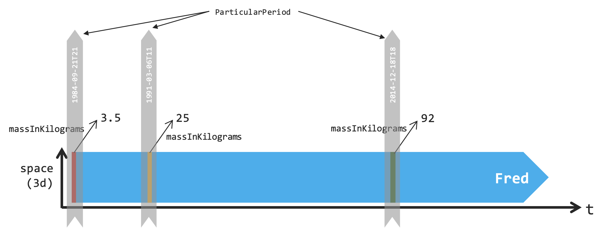

# The BORO Method

The **BORO (Business Objects Reference Ontology) Method** is the methodological foundation of IES. Understanding BORO is essential to understanding why IES works the way it does.

**Core principle**: BORO is not concerned with the **words** used to describe concepts. Instead, it focuses on identifying things by their **extent**—the space and time they occupy.

## Table of Contents

- [The Problem BORO Solves](#the-problem-boro-solves)
- [Identity by Extent](#identity-by-extent)
  - [For Physical Things](#for-physical-things)
  - [For Classes](#for-classes)
- [BORO in Practice](#boro-in-practice)
  - [Simple vs Challenging](#simple-vs-challenging)
  - [The Benefit Despite the Challenge](#the-benefit-despite-the-challenge)
- [Extent Types](#extent-types)
  - [Spatio-Temporal Extent](#spatio-temporal-extent)
  - [Set-Theoretic Extent](#set-theoretic-extent)
- [Key BORO Concepts in IES](#key-boro-concepts-in-ies)
  - [Elements](#elements)
  - [The Four-Dimensional Worldview](#the-four-dimensional-worldview)
- [Practical Implications](#practical-implications)
  - [For IES Users](#for-ies-users)
  - [For IES Implementers](#for-ies-implementers)
- [BORO&#39;s Historical Success](#boros-historical-success)
  - [ISO15926 (Oil &amp; Gas)](#iso15926-oil--gas)
  - [IDEAS (Defence)](#ideas-defence)
  - [IES (UK Government)](#ies-uk-government)
- [The Challenge of Perfection](#the-challenge-of-perfection)
  - [IES&#39;s Pragmatic Approach](#iess-pragmatic-approach)
- [Key Takeaways](#key-takeaways)

## The Problem BORO Solves

Traditional information systems often fail because of terminological confusion:

- Different organisations use **different names** for the same thing
- The **same name** is used by different parties to describe different things
- Words have **ambiguous** or **context-dependent** meanings

>   **Warning**: The Root Cause
    The creator of BORO places the blame for poor information systems squarely on this terminological problem. We're all wedded to our own vocabularies and views of the world.

BORO takes a radically different approach: **ignore the names and focus on the actual things**.

---

## Identity by Extent

The cornerstone of BORO is its "**criteria for identity**"—how we determine whether two things are the same thing.

### For Physical Things

> **If two things occupy precisely the same space at precisely the same time, they are the same thing.**

This is clear and unambiguous:



Fred's spatio-temporal extent encompasses all of Fred across his entire lifetime. 1984-Fred and 2014-Fred are **states** of the same Fred because they're parts of the same spatio-temporal extent.

### For Classes

> **If two classes have identical membership, they are the same class.**

Example: **Equilateral triangles** and **equiangular triangles**

- Every equilateral triangle is equiangular
- Every equiangular triangle is equilateral
- Therefore: same membership
- Therefore: **same class** (with multiple names)

>   **Note**: One Thing, Multiple Names
    In BORO, you create **one thing** (class or element) and attach **multiple names**, each with appropriate context. This eliminates duplication and ambiguity.

---

## BORO in Practice

### Simple vs Challenging

Whilst BORO sounds simple in principle, using it is **anything but simple**:

- We're all attached to our terminologies
- Different viewpoints feel natural to different people
- Reaching consensus on extent requires careful analysis
- Committee-based BORO analysis can be very challenging

>   **Note**: IES and BORO
    **IES 4 is not a "pure" BORO ontology**. It has been **guided by the BORO approach** but retains many concepts and structures from previous IES versions to maintain continuity and practical usability.

### The Benefit Despite the Challenge

Despite the difficulty, BORO provides:
1. **Unambiguous identity**: No confusion about what's the same and what's different
2. **Precise integration**: Different systems can reliably exchange information
3. **Reduced duplication**: One thing with many names, not many things with confusing names
4. **Implementation independence**: Identity doesn't depend on how data is stored

---

## Extent Types

BORO recognises different types of extent:

### Spatio-Temporal Extent

For **physical things** (Elements in IES):

| Dimension               | Meaning                | Example                                   |
| ----------------------- | ---------------------- | ----------------------------------------- |
| **Space (3D)**    | Physical location      | Fred occupies approximately 0.07 m³      |
| **Time (1D)**     | Temporal duration      | Fred exists from 1984 to present          |
| **Combined (4D)** | Spatio-temporal volume | Fred's complete life across all locations |


**Example**: "Fred Through Time"
```
Each "slice" is a State of Fred.
The whole extent is Fred the Entity.
```

### Set-Theoretic Extent

For **classes** (ClassOfElement in IES):
- Extent = the complete membership of the class
- If two classes have identical members, they have identical extent
- Therefore, they are the same class

---

## Key BORO Concepts in IES

### Elements

In IES, an **Element** is:

> Anything with a spatio-temporal extent—things that occupy space and time.

This includes:
- **Entities**: Whole-life things (e.g., Fred throughout his entire life)
- **States**: Temporal slices of Entities (e.g., Fred on Monday)
- **Events**: Happenings involving participants (e.g., Fred's birth, a meeting)
- **PeriodOfTime**: Temporal extents (e.g., January 2024, 10:00-11:00)

### The Four-Dimensional Worldview

BORO leads naturally to treating time the same way as space:

- Just as Fred can be **spatially divided** (left hand, right hand), Fred can be **temporally divided** (Monday-Fred, Tuesday-Fred)
- Just as objects can overlap in space, they can overlap in time
- Just as we can describe spatial relationships (`isPartOf`, `isLocatedAt`), we can describe temporal relationships

>   **Note**: The Power of 4D
    This consistent treatment of space and time allows **complex temporal logic** to be expressed using **very simple constructs**.

---

## Practical Implications

### For IES Users

Understanding BORO means understanding that:
1. **Identity is about extent**, not names
   - Don't create a new Entity just because someone uses a different name
   - Do create a new Entity if the spatio-temporal extent is different
2. **States are everywhere**
   - Most things you model will be States of Entities
   - States capture how Entities change over time
3. **Names are representations**
   - Multiple names can refer to the same thing
   - Names are attached to things, not inherent in them

### For IES Implementers

BORO principles guide implementation:
1. **URI management**: Use extent-based identifiers where possible
2. **Deduplication**: Check spatio-temporal extent before creating new Elements
3. **Integration**: Match things by extent, not labels
4. **Versioning**: Use States to represent versions, not separate Entities

---

## BORO's Historical Success

BORO has proven successful in multiple domains:

### ISO15926 (Oil & Gas)

- International standard for lifecycle data sharing
- Used by major oil companies worldwide
- Manages complex technical data over decades

### IDEAS (Defence)

- 5EYES collaborative ontology (AUS, CAN, FRA, SWE, UK, US, NATO)
- Influenced DoDAF, MODAF, NAF, UPDM
- Foundation for defence architecture frameworks

### IES (UK Government)

- Extends IDEAS for broader UK Government use
- Designed for defence, policing, national security
- Expanding to other government domains

>   **Note**: Proven Track Record
    BORO isn't theoretical—it has been battle-tested in complex, mission-critical systems across multiple domains and nations.

---

## The Challenge of Perfection

### IES's Pragmatic Approach

> "IES 4 could not claim to be a full BORO ontology. Rather, it has been **guided by the BORO approach**, but still retains many of the concepts and structures from previous versions of IES."

This pragmatism reflects reality:
- **Perfect BORO** requires unanimous agreement on every extent definition
- **Committee-based ontology** development means compromise
- **Evolution** from previous versions means continuity matters
- **Usability** sometimes requires practical shortcuts

>   **Note**: Good Enough is Good
    IES doesn't have to be a perfect BORO ontology to benefit from BORO's principles. Guided by BORO is sufficient for precise, reliable information exchange.

---

## Key Takeaways

 The essential principles and practical implications of the BORO methodology:
    1. **Identity = Extent**: Things with the same spatio-temporal extent are the same thing
    2. **Names are secondary**: Focus on what things are, not what they're called
    3. **4D naturally follows**: Treating time like space is a consequence of extent-based identity
    4. **States are fundamental**: Temporal slices enable precise modelling of change
    5. **Proven methodology**: BORO has succeeded in multiple complex domains

---

*Understanding BORO is key to understanding IES. Take time to internalise the extent-based approach to identity—it will make everything else much clearer.*
