# Extending IES4

**Applicable to all minor versions of IES4**

Version: 202403v1.0 (derived from "Extending IES4 202403v1.0 O.pdf")

## Introduction

This document provides guidance on how to extend IES4 for specific local needs.

You cannot simply add an orphaned concept into such a formal ontology. The concept must extend an existing concept in IES. We do this by finding the closest, similar concept. This is normally a more generalised concept of the one you seek to add. It is from this concept that we make our extension. 

**Examples:**

- If you wanted to add `PassengerShip`, the closest concept in IES is the class `ies:Ship`
- If you wanted to add a specific relation `motherOf`, you would extend from the relationship `ies:isParentOf`

### RDF Schema Relationships for Extensions

IES utilises the following RDF Schema relationships for extensions:

- **`rdfs:subClassOf`** for extending classes
- **`rdfs:subPropertyOf`** for extending attributes or relationships

Throughout this document, we illustrate how to create extensions using a mix of UML diagrams and RDF triples. The triples presented utilise the following prefixes:

- `ies:` – referring to things in the IES ontology
- `ont:` – referring to things in an example, local ontology
- `data:` – referring to things in an example, instance dataset

---

## Simple Extensions

### Defining New Local Classes

Let's say there is a need to extend IES to introduce two new types of Ship: a `PassengerShip` and a `CargoShip`. As discussed in the introduction, first we want to search the IES ontology to identify the closest class that matches our requirement. Here, `ies:Ship` is the obvious choice.

Then, in our local ontology namespace, we add these new classes using the `rdfs:subClassOf` relation as illustrated below. These new classes will therefore inherit all attributes and relationships already associated with `ies:Ship`.

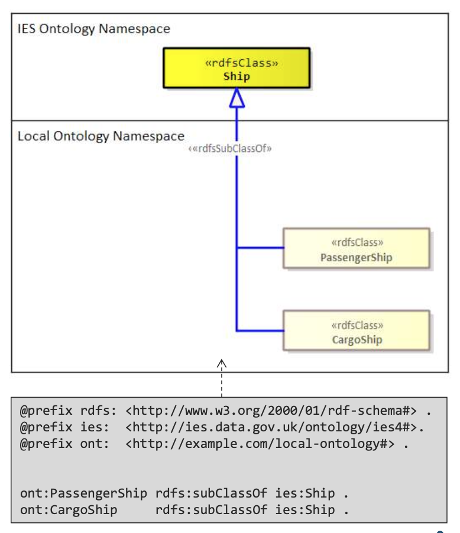

```turtle
@prefix rdfs: <http://www.w3.org/2000/01/rdf-schema#> .
@prefix ies: <http://ies.data.gov.uk/ontology/ies4#> .
@prefix ont: <http://example.com/local-ontology#> .

ont:PassengerShip rdfs:subClassOf ies:Ship .
ont:CargoShip rdfs:subClassOf ies:Ship .
```

### Using New Local Classes

Now that we have our new extensions, we can use them in our data. We follow the normal approach to instantiation using `rdf:type` (or the shorthand "`a`"), i.e. we make the instance a type of one of our local classes. 

**However**, in addition, we also make this instance a type of the nearest class in IES. This caters for consumers which may not have access to our local ontology, so at the very least they can understand what sort of IES thing our instance is meant to be.

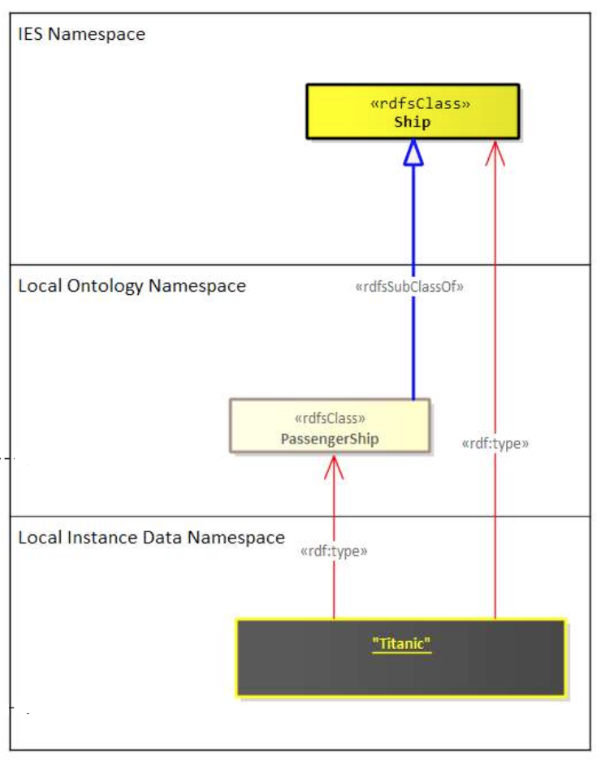

#### Why Dual Typing?

For example, as a consumer, you may have a query for getting all instances of `ies:Ship`. If you were then given data that only typed things as either `ont:PassengerShip` or `ont:CargoShip`, your query would miss those ship instances. 

By also providing the type of the nearest IES class, we allow for such queries to continue to work—i.e. we don't miss any ships and only miss the extra subtype detail. This provides a form of **backward compatibility**, giving consumers flexibility to update their queries in their own time without the fear of them missing out on the information they care about.

```turtle
data:Titanic a ont:PassengerShip .
data:Titanic a ies:Ship .
```

### Defining New Attributes and Relationships

The same approach as already specified applies here at first: find the closest attribute or relationship in IES. However, the extension is created using `rdfs:subPropertyOf` rather than `rdfs:subClassOf`. 

Sometimes you might need to articulate the `rdfs:domain` (for attributes and relationships) and `rdfs:range` (only for relationships) of the extension if you want to narrow down its association to specific classes. 

As with extending classes and for the same reasons, you **MUST** also articulate the nearest equivalent in IES. See the examples below.

#### Example: Extending Relationships

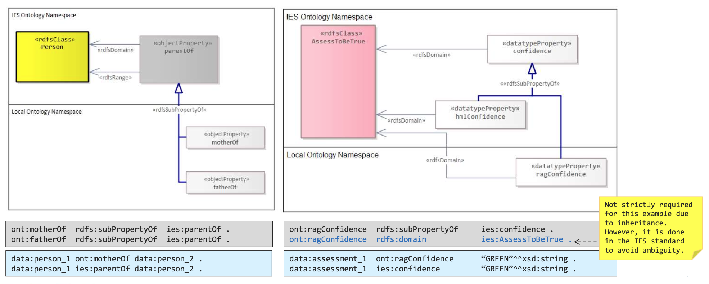

```turtle
ont:motherOf rdfs:subPropertyOf ies:parentOf .
ont:fatherOf rdfs:subPropertyOf ies:parentOf .

data:person_1 ont:motherOf data:person_2 .
data:person_1 ies:parentOf data:person_2 .
```

#### Example: Extending Attributes

```turtle
ont:ragConfidence rdfs:subPropertyOf ies:confidence .
ont:ragConfidence rdfs:domain ies:AssessToBeTrue .

data:assessment_1 ont:ragConfidence "GREEN"^^xsd:string .
data:assessment_1 ies:confidence "GREEN"^^xsd:string .
```

!!! note "Avoiding Ambiguity"
    The second triple stating the IES equivalent (`ies:confidence`) is not strictly required for this example due to inheritance. However, it is done in the IES standard to avoid ambiguity.

---

## Permissible Extension Boundary

IES has a small number of concepts at the top of its hierarchy. **It is not permissible to extend the broader concepts found above this level** (e.g. `ExchangeItem` and `Element`). 

This ensures that, at the very least, consumers of data that use extensions can at least understand what key concepts are being exchanged. 

The diagram below shows those concepts (within the grey boundary) which **cannot be extended**:

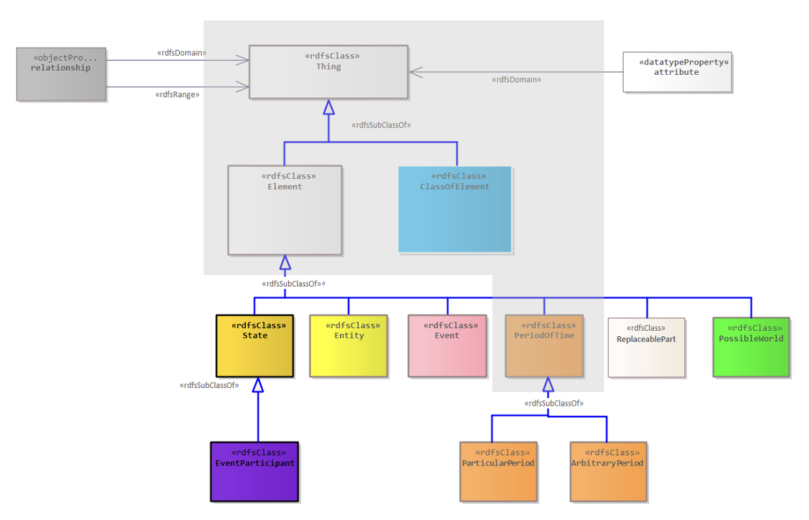

The non-extensible concepts are:

- `Thing` (and concepts at that level)
- `Element` / `ClassOfElement`
- The top-level relationships (`relationship`, `attribute`, `isPartOf`)

All concepts **below** this boundary (shown in colour in the diagram) are extensible:

- `State` (yellow)
- `Entity` (yellow)
- `Event` (pink)
- `PeriodOfTime` (orange)
- `EventParticipant` (purple)
- `PossibleWorld` (green)

---

## Finding the Right Level to Extend From

1. What kind of IES thing is it?
2. Which IES pattern is it most like?
3. Which names and definitions encapsulate my concept?
4. Does it have spatio-temporal extent?

You might find that you ask these questions of your concept in different orders, and you might have to repeatedly ask such questions as you work your way across the model and up (or down) potential hierarchies.

In the examples presented thus far, it has been evident where to make an extension from. However, there are times where this is less obvious. Here are some questions you can ask about your new concept to help find that right level:

### Question 1: What kind of IES thing is it?

Does it have spatio-temporal extent? I.e. is it an `Element`? Or is it a set/class? Is it more a representation, identifier, or measure? 

If it's an element, which of the high-level types of element is it? Is it a single entity or does it involve multiple entities (i.e. an event)? 

If your concept doesn't apply to any of the above, then a relationship or attribute could be considered.* However, these are last-resort options and should only really be considered if there is an existing relationship or attribute that is very close to the extension you seek.

!!! warning "Relationships and Attributes as Last Resort"
    Relationships (apart from `rdf:type`, subtype, `isPartOf`) and attributes in IES are normally shortcuts for more elaborate 4D structures. Where you see these in the model, a pragmatic choice has been made to provide a shortcut for such elaborate structures. As a result, they are last-resort options when considering a level to extend from.

### Question 2: Which IES pattern is it most like?

The IES standard presents the model through a series of diagrams which represent major, reusable patterns. Seek the titles of patterns that have some relevance to the concept you want to add.

### Question 3: Which names and definitions encapsulate my concept?

Use the definitions of IES classes, relationships, and attributes to guide you. The definition should really cover as close to 100% of what your concept talks about, even if it's covered in a vague sense. 

If there is something in the definition that clearly doesn't apply to your new concept, then it is most likely not suitable. Discounting what it's **not** is a useful approach. 

Sometimes you might also want to consider things from a set theory point of view. Consider your concept as a set and ask: will all the members of my new set also be found within the proposed super set?

### Question 4: Do the relationships and attributes also apply to my concept?

For class extensions, check if the relationships and attributes that hang off the proposed super class also apply to your new class.

---

## Complex Extensions

### The Wrong Way: Nested Hierarchies

Earlier on in this pack, we went through a simple extension example where we added two subtypes of `ies:Ship` to our local ontology: `PassengerShip` and `CargoShip`. Imagine now we have an additional requirement to include type information about how they are powered, which applies to both subtypes.

One solution is to develop a class hierarchy that is "nested" (shown in the diagram below). However, this introduces a lot of duplication. The compounding of the types in the subclasses will cause headaches when you want to query for specific facets* of a ship—e.g. we only want fossil-fuelled powered ships returned by our query.

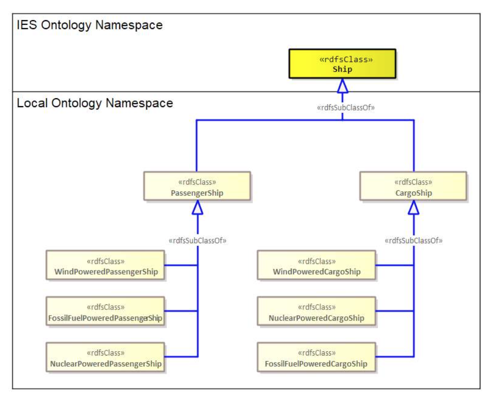

!!! info "Faceted Classification"
    *A faceted classification system uses a set of semantically cohesive categories that are combined as needed to create an expression of a concept.

#### Problems with Nested Hierarchies:

1. **Duplication** – Each combination requires its own class
2. **Poor queryability** – Querying for a single facet (e.g. "all fossil-fuelled ships") becomes complex
3. **Maintenance burden** – Adding a new dimension requires creating many new classes
4. **Semantic confusion** – The meaning of the hierarchy becomes muddled

**Example of what NOT to do:**

```
ies:Ship
├── ont:PassengerShip
│   ├── ont:WindPoweredPassengerShip
│   ├── ont:FossilFuelPoweredPassengerShip
│   └── ont:NuclearPoweredPassengerShip
└── ont:CargoShip
    ├── ont:WindPoweredCargoShip
    ├── ont:FossilFuelPoweredCargoShip
    └── ont:NuclearPoweredCargoShip
```

This creates six leaf classes with significant duplication!

### The Right Way: Faceted Classification using Powersets

A faceted approach can be developed in IES using **powersets**. We create classes in an atomic way and then group them using a class one level up (i.e. the powerset). Here, our powersets are found in a hierarchy that extends from `ies:ClassOfDevice`.

This approach helps create a flatter, easier-to-maintain structure that is easier to query. Moreover, this removes the need for compounding types.

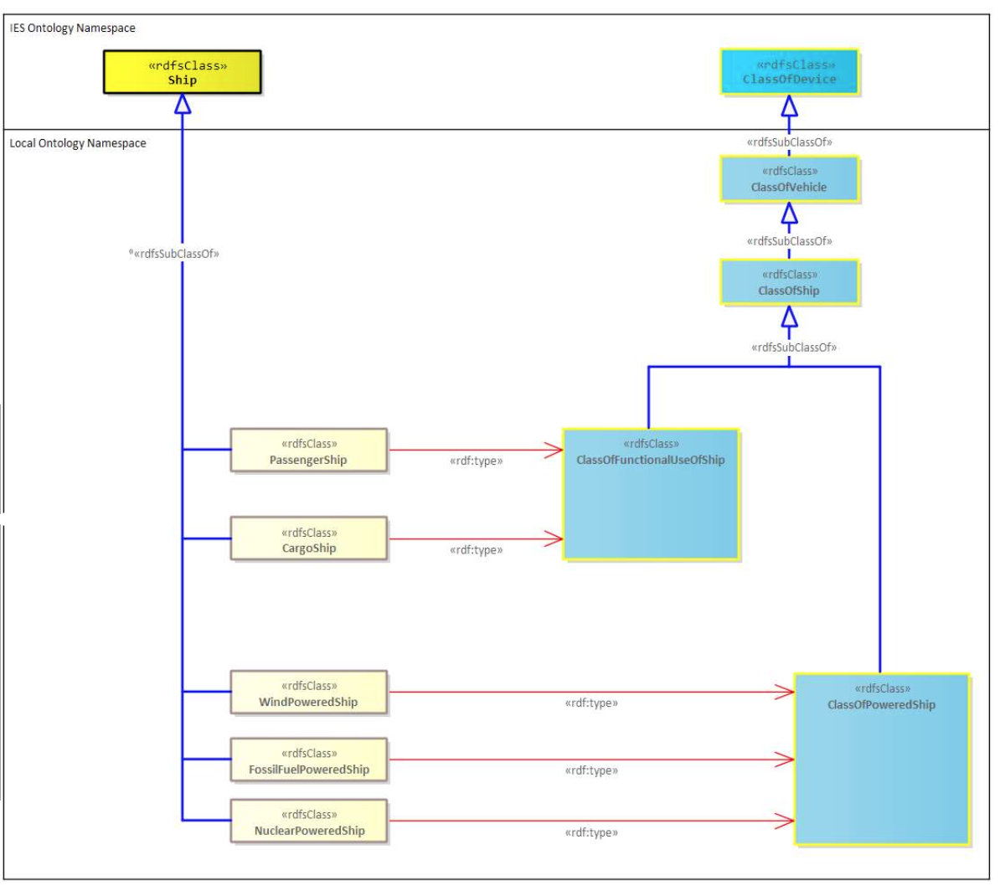

#### Setting Up the Powerset Hierarchy

```turtle
ont:ClassOfVehicle rdfs:subClassOf ies:ClassOfDevice .
ont:ClassOfShip rdfs:subClassOf ont:ClassOfVehicle .
ont:ClassOfFunctionalUseOfShip rdfs:subClassOf ont:ClassOfShip .
ont:ClassOfPoweredShip rdfs:subClassOf ont:ClassOfShip .
```

#### Defining Atomic Ship Types

```turtle
# Functional use facet
ont:PassengerShip rdfs:subClassOf ies:Ship .
ont:PassengerShip a ont:ClassOfFunctionalUseOfShip .

ont:CargoShip rdfs:subClassOf ies:Ship .
ont:CargoShip a ont:ClassOfFunctionalUseOfShip .

# Power source facet
ont:WindPoweredShip rdfs:subClassOf ies:Ship .
ont:WindPoweredShip a ont:ClassOfPoweredShip .

ont:FossilFuelPoweredShip rdfs:subClassOf ies:Ship .
ont:FossilFuelPoweredShip a ont:ClassOfPoweredShip .

ont:NuclearPoweredShip rdfs:subClassOf ies:Ship .
ont:NuclearPoweredShip a ont:ClassOfPoweredShip .
```

#### Benefits of the Faceted Approach:

1. **Atomic classes** – Each class represents a single facet
2. **Easy querying** – Want all fossil-fuelled ships? Just query for `ont:FossilFuelPoweredShip`
3. **Flexible combination** – Instances can have multiple types from different facets
4. **Maintainable** – Adding a new power source only requires one new class, not multiple

### Additional "Plumbing": Powertype Declarations

Introducing new powersets as we did with the hierarchy extending from `ies:ClassOfDevice` sometimes requires us to do some additional ontology plumbing. We need to explicitly declare that our new `ont:ClassOfVehicle` and `ont:ClassOfShip` are powertypes of the equivalent elements currently in IES. In other words:

- **ALL** subtypes of `ies:Vehicle` are members of `ont:ClassOfVehicle`; and
- **ALL** subtypes of `ies:Ship` are members of `ont:ClassOfShip`

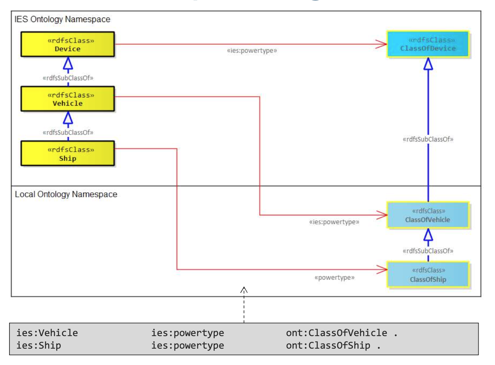

```turtle
ies:Vehicle ies:powertype ont:ClassOfVehicle .
ies:Ship ies:powertype ont:ClassOfShip .
```

!!! note "When Powertype Declarations Are Needed"
    We don't need this for the other powersets we introduced—`ont:ClassOfFunctionalUseOfShip` and `ont:ClassOfPoweredShip`. This is because we have not introduced any extensions that have subtypes which are all members of these powersets.

### Reminder: Powertype Relationship

To be able to talk about classes that are themselves members of other classes, we need to be able to "push up" to the next type level. BORO ontologies such as IES have no limit to the number of layers you can go up. Each layer is connected to the previous by an `rdf:type` or an `ies:powertype` relationship.

#### Example: Ranks

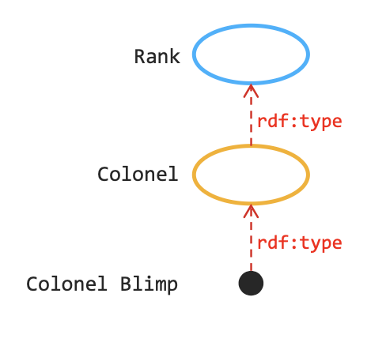

In this example:
- Colonel Blimp is an instance of (`rdf:type`) the class Colonel
- Colonel is an instance of the class Rank
- Colonel Blimp is **not** an instance of Rank though
- Therefore, `rdf:type` is **not transitive**

#### Example: Documents

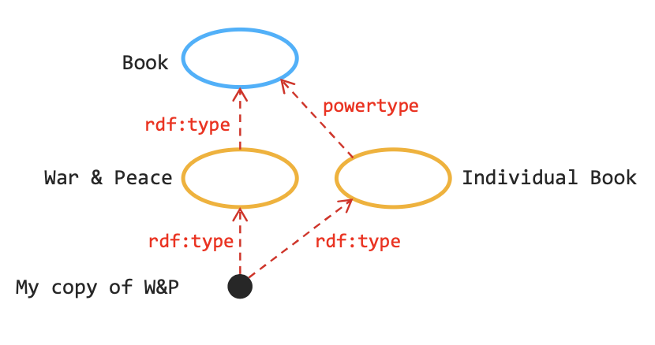

The mechanism used for stepping up the type levels in IES is the `ies:powertype` relationship. It relates a Class to another class whose members are all possible subtypes of that Class. 

This is a bit of logical plumbing in IES and may not be of interest to all users. If you are interested in this topic, start by looking up "powerset" on Wikipedia and then look at Cantor's theorem.

### Using New Local Classes with Faceted Types

Because of the faceted approach we have taken, our ship instances will now have **two types** as shown here with the Titanic. And, as is required to cater for those without access to our ontology extensions, a **third type** is needed to state the nearest IES equivalent.

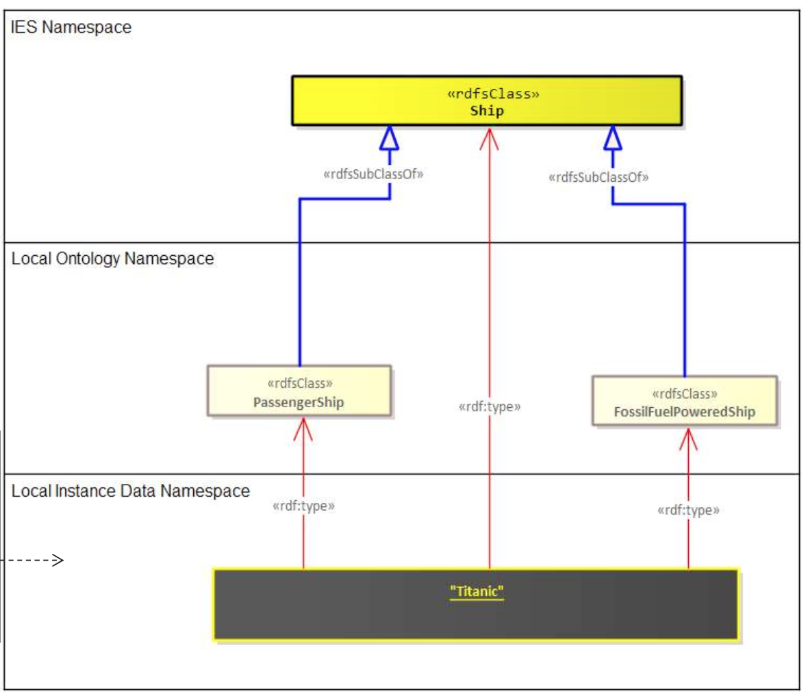

```turtle
@prefix rdf: <http://www.w3.org/1999/02/22-rdf-syntax-ns#> .
@prefix ies: <http://ies.data.gov.uk/ontology/ies4#> .
@prefix ont: <http://example.com/local-ontology#> .
@prefix data: <http://example.com/local-data#> .

data:Titanic a ont:PassengerShip .
data:Titanic a ont:FossilFuelPoweredShip .
data:Titanic a ies:Ship .
```

The Titanic is:
1. A passenger ship (functional use facet)
2. A fossil-fuelled powered ship (power source facet)
3. A ship (base IES class for backward compatibility)

---

## Specific guidance for extending Entities

There is a bit of a “chicken-and-egg” situation that arises when considering extensions to an `Entity`. Concrete types of `Entity` (such as `Person`, `Organisation`, `Vehicle`) are effectively special types of their respective states (`PersonState`, `OrganisationState`, `VehicleState`). An `Entity` can be viewed as a maximal state, covering the entire duration of the existence of an `Entity`.

The chicken-and-egg situation arises from questions about which should you extend first, an appropriate `State` or `Entity`. For example, if you wanted to add a new subclass of `Device` (say `ont:Robot`), do you create an extension of `DeviceState` first (say `ont:RobotState`) and then make the new entity a subclass of the new state? i.e., `Robot subClassOf RobotState`.

The rule is, if you are adding a new `Entity` where its states would have no additional special relationships and/or attributes compared to its superclass’s states, then there is no need to create a specific state for this entity at all. Just extend directly from the appropriate `Entity` as per the illustrated example and utilise the superclass’s associated state. If there are special relationships / attributes, then extend the state first. As mentioned earlier in the document, adding new relationships and attributes is a last-resort move, therefore the latter form of extension, is a rare case.

```turtle
ont:Robot rdfs:subClassOf ies:Device .

data:robot_1 a ont:Robot .
data:robot_1_state_1 a ies:DeviceState .
data:robot_1_state_1 ies:isStateOf data:robot_1.
```

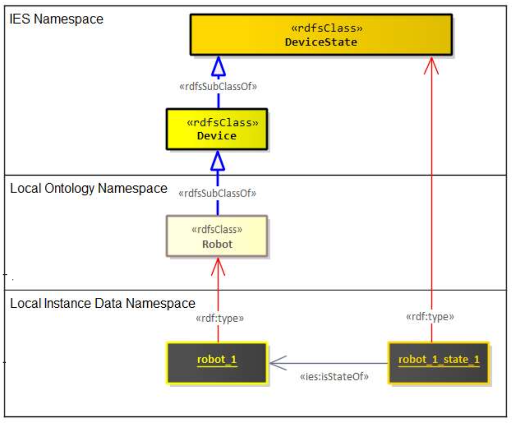

---

## Extension Naming Convention

Below is a set of mandatory (**MUST** and **MUST NOT**) rules and recommended (**SHOULD** and **SHOULD NOT**) rules for naming your extensions. These are based on recommendations made by Matthew West in his book _"Developing High Quality Data Models"_.

### All Extensions

**Mandatory rules:**

- **MUST** be based on the real-world thing it is representing
- **MUST NOT** be based on the data record which is itself based on the real-world thing
- **MUST NOT** use special characters or whitespace

**Recommended rules:**

- **SHOULD** use name(s) that suggest the definition
- **SHOULD** avoid using the same word(s) as used elsewhere in IES or your local ontology. If that is hard to avoid, reduce confusion by adding a qualifying term to make it unambiguous
- **SHOULD** avoid abbreviations—e.g. `GPAppointment` should be `GeneralPractitionerAppointment`
- **SHOULD** use a similar naming pattern and/or structure as the superclass or superproperty

### Extensions to Elements

**Mandatory rules:**

- **MUST** use PascalCase

**Recommended rules:**

- **SHOULD** be a noun

### Extensions to ClassOfElements

**Mandatory rules:**

- **MUST** use PascalCase

**Recommended rules:**

- **SHOULD** be a noun
- **SHOULD** keep to the convention of being prefixed with "ClassOf"

### Extensions to Relationships or Attributes

**Mandatory rules:**

- **MUST** use camelCase

**Recommended rules:**

- **SHOULD** (either of these might appear more natural in a particular circumstance):
    - Provide some connective text that reads as a sentence between the domain and range for a relationship, or the domain and the literal for an attribute; **or**
    - Be named in terms of the role it plays with respect to the domain

---

## Best Practices Summary

When extending IES4, follow these best practices:

1. **Always extend from the closest matching IES concept** – Search the ontology thoroughly before creating extensions

2. **Provide dual typing for backward compatibility** – Always type instances with both your local class and the nearest IES class

3. **Use faceted classification for complex extensions** – Avoid nested hierarchies; use powersets instead

4. **Follow naming conventions** – Use PascalCase for classes, camelCase for properties

5. **Document your extensions** – Maintain clear definitions for all local classes and properties

6. **Respect the extension boundary** – Do not extend top-level concepts like `Thing`, `Element`, or `ExchangeItem`

7. **Declare powertype relationships when needed** – Explicitly state powertype relationships when introducing new classification hierarchies

8. **Test queryability** – Ensure your extension structure supports the queries your consumers need to run

---

## Document Information

- **Version:** 202403v1.0
- **Status:** stable
- **Applicable to:** All minor versions of IES4
- **Related Documents:**
    - Information Exchange Standard r4.3.1
    - IES Examples 202403
    - Instantiation Patterns in IES4 202402v1.0