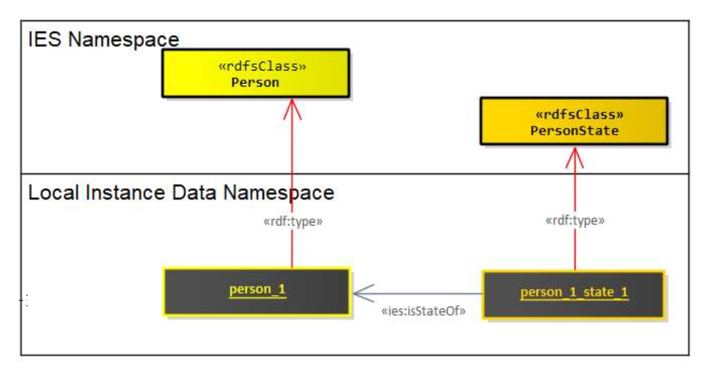
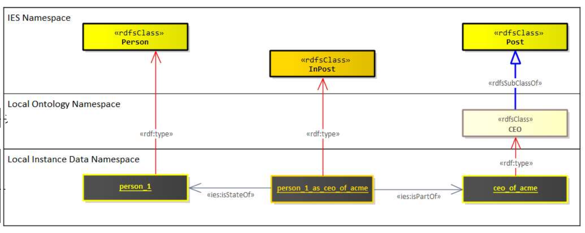
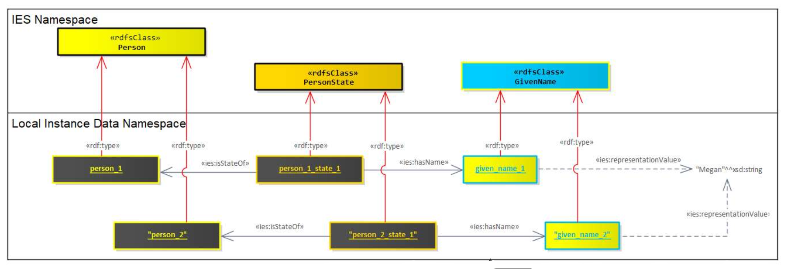
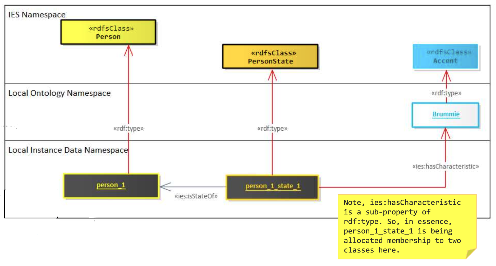

# Instantiation Patterns in IES

*Based on version 4.4.0*

---

## Introduction

Formal ontologies like IES are normally designed with very opinionated semantics based on logical and/or philosophical commitments like the [BORO 4D approach](boro-methodology.md) or set theory. This makes them ideal to be used as general-purpose data exchange standards. Consequently, these commitments necessitate additional considerations when mapping equivalent data to IES from representations like the JSON below.

One set of considerations is how things are instantiated. This document explores the most common instantiation patterns and articulates the rules that apply to their use.

```json
{
  "name": "Megan", 
  "accent": "BRUMMIE", 
  "job": "CEO"
}
```

These instantiation patterns will be articulated using the mappings of the JSON attributes introduced above into IES. A mix of UML diagrams and RDF triples are used to articulate these patterns. The triples presented will utilise the following prefixes:

- **ies:** – referring to things in the IES ontology
- **ont:** – referring to things in an example, local ontology
- **data:** – referring to things in an example, instance dataset

---

## Element Instances

This is the most common and naturally intuitive pattern of instantiating a thing with IES. Commonly used for most IES Elements. Here is an example of instantiating an `ies:Person` and an associated `ies:PersonState` (a temporal slice of a person).



### Example

```turtle
data:person_1 a ies:Person .
data:person_1_state_1 a ies:PersonState .
data:person_1_state_1 ies:isStateOf data:person_1 .
```

Human-readable identifiers associated with these elements (e.g., the name Megan) are normally found a few node-hops away from these elements on instances of `ies:Name` or `ies:Identifier`. These Name instances will be discussed later in this document.

Occasionally, creating instances of certain elements requires additional effort. Certain classes are naturally too broad to cover certain data requirements e.g., Vehicle, Device and Post. Typically, you might want to instantiate against more detailed categories, like a particular brand and model of a Vehicle or Device, or a specific job post within an organisation.

Ideally, we should first build out such categories or taxonomies into our local ontology before instantiating them. There will be times when these types are data-driven or sourced from free-text fields resulting in these types needing to be created "on-the-fly".

### Example



```turtle
data:person_1 a ies:Person .
data:person_1_as_ceo_of_acme a ies:InPost .
data:ceo_of_acme a ont:CEO .
data:person_1_as_ceo_of_acme ies:isStateOf data:person_1 .
data:person_1_as_ceo_of_acme ies:isPartOf data:ceo_of_acme .

ont:CEO rdfs:subClassOf ies:Post .
```

### Further Guidance

For more details on creating subclasses against the IES ontology, see [Extending IES](extending-ies.md).

---

## Name Instances

Names are a special form of representation used for identifying things. Anything can be identified by many names (or its subclass, identifiers). An important nuance of names in IES is that when we instantiate a name, like here, the given name of Megan; that instance is not shared with other instances of people called Megan. Instead, each instance of a given name is a unique form of utterance for identifying a single thing.

The thing that is shared between two things with the same name is the string literal at the end of the `representationValue` attribute.

### Example



```turtle
data:person_1 a ies:Person .
data:person_1_state_1 a ies:PersonState .
data:person_1_state_1 ies:isStateOf data:person_1 .

data:person_2 a ies:Person .
data:person_2_state_1 a ies:PersonState .
data:person_2_state_1 ies:isStateOf data:person_2 .

data:person_1_state_1 ies:hasName data:given_name_1 .
data:given_name_1 a ies:GivenName .
data:given_name_1 ies:representationValue "Megan"^^xsd:string .

data:person_2_state_1 ies:hasName data:given_name_2 .
data:given_name_2 a ies:GivenName .
data:given_name_2 ies:representationValue "Megan"^^xsd:string .
```

### Theoretical Basis

This pattern for names is based on P.F. Strawson's theory of description and utterances, and Quine's *Roots of Reference*. 

!!! note
    This pattern does not apply to the superclass of Name, Representation.

---

## Class Instances

BORO ontologies such as IES allow the instantiation of classes that are themselves members of other classes. Instances of characteristics, measures and representations are such examples where this pattern is used. In this example we create a new class instance of Accent for the *Brummie* accent.

### Example



```turtle
data:person_1 a ies:Person .
data:person_1_state_1 a ies:PersonState .
data:person_1_state_1 ies:isStateOf data:person_1 .
data:person_1_state_1 ies:hasCharacteristic ont:Brummie .

ont:Brummie a ies:Accent .
```

### Important Notes

!!! warning "Note on hasCharacteristic"
    `ies:hasCharacteristic` is a sub-property of `rdf:type`. So, in essence, `person_1_state_1` is being allocated membership to two classes here.

!!! warning "Common Mistake"
    A common mistake is to assume that the human-readable value for this class instances is to be found at the end of the `representationValue` attribute. This only applies for instances of representations. All other class instances should be treated as equivalent to extensions to the IES ontology. If you do need a human-readable string for such instances, use `rdfs:label`.

---

## Summary of Patterns

### Pattern Selection Guide

| Pattern | Use When | Example |
|---------|----------|---------|
| **Element Instances (Basic)** | Creating standard IES Elements | Person, Organisation, Event |
| **Element Instances (Extended)** | Need more specific types than IES provides | Specific vehicle model, job title |
| **Name Instances** | Identifying things with names/identifiers | Given names, identifiers |
| **Class Instances** | Instantiating characteristics, measures, or representations | Accents, colours, dispositions |

### Key Principles

1. **Element instances** are the most common pattern - create instances of IES classes directly
2. **Names are not shared** - each name instance is unique to the thing it identifies; only the literal string value is shared
3. **Class instances** allow characteristics and measures to be modelled as classes themselves
4. **Extensions** can be created on-the-fly when needed, but ideally should be defined in advance in your local ontology
5. **Human-readable values** are found via `representationValue` only for Representations; use `rdfs:label` for class instances

---

## Additional Resources

- **Extending IES** - Guidance on creating subclasses and extending the ontology
- **IES Examples** - Worked examples of these patterns in practice
- **ies.ttl** - The authoritative IES ontology specification
