# Introduction to IES

---

The UK Government "Information Exchange Standard" is a specification of how to exchange data between interested parties. The scope of the standard has been deliberately left open, but has initially been focussed on information pertinent to defence, policing and national security.

The standard was developed in recognition of the number of point-to-point interfaces that were being developed and maintained in UK Government, few of which conformed to any official data standards. These interfaces tended to be fragile, restricted business agility and were costly to maintain. The IES is a data standard for structured business data, intended to de-couple applications and simplify the application infrastructure.

The standard is designed to be extensible, and is based on a number of re-usable patterns of business. The IES borrows heavily from an existing defence standard (the IDEAS specification) developed between a number of national defence departments in the mid 2000s to enable sharing of enterprise architecture data. IDEAS in turn was based on the BORO methodology and the ISO15926 standard. IES follows the UK Government preferred data exchange approach, using W3C RDF Standard to serialise the data. Use of RDF provides standard formats in JSON and XML, as well as a number of open-source tools for working with the data.

**Acronyms:**

- RDF = Resource Definition Framework (data representation standard)
- W3C = World Wide Web Consortium (standards body, responsible for http, XML, RDF, etc.)
- BORO = Business Objects Re-engineering Ontology (a data modelling method)
- IDEAS = International Defence Enterprise Architecture Standard (AUS, CAN, UK, US, SWE, FRA, NATO)
- XML = eXtensible markup language (W3C standard for data serialisation)
- JSON = JavaScript Object Notation (data serialisation standard)

---

## Table of Contents

- [Usage: Data Exchange](#usage-data-exchange)
- [Usage: Synchronisation](#usage-synchronisation)
- [Usage: Storage](#usage-storage)
- [Architecture](#architecture)
- [Data Model Approach](#data-model-approach)
- [Model Overview](#model-overview)
- [Compositional Modelling Approach](#compositional-modelling-approach)
- [Model Notation](#model-notation)
- [RDF Overview](#rdf-overview)
- [RDF URIs](#rdf-uris)
- [RDF Schema](#rdf-schema)
- [More on Classes and Subclasses](#more-on-classes-and-subclasses)
- [Instance Notation](#instance-notation)
- [RDF Serialisation Example](#rdf-serialisation-example)
- [Core Model Structure](#core-model-structure)
- [Space &amp; Time](#space--time)
- [Space-Time Diagrams](#space-time-diagrams)
- [IES Model – Elements](#ies-model--elements)
- [Elements - Back to Fred](#elements---back-to-fred)
- [Applying the Pattern](#applying-the-pattern)
- [Temporal State Composition](#temporal-state-composition)
- [Event Modelling](#event-modelling)
- [Event Participant](#event-participant)
- [Temporal Precision](#temporal-precision)
- [Bounding State](#bounding-state)
- [Temporal State Representations](#temporal-state-representations)
- [IES Time Elements](#ies-time-elements)
  - [Locations](#locations)
  - [Quick Recap](#quick-recap)
- [Names and Identifiers](#names-and-identifiers)
  - [Information](#information)
  - [Representation](#representation)
  - [Transitivity](#transitivity)
  - [Power types](#power-types)
  - [Representations Types](#representations-types)
  - [Naming schemes](#naming-schemes)
  - [Hierarchies of Naming Schemes](#hierarchies-of-naming-schemes)
  - [Quick recap - representation](#quick-recap---representation)
- [Summary of Core Patterns](#summary-of-core-patterns)
- [Worked Example - Fred in Hospital](#worked-example---fred-in-hospital)
  - [Introduction](#introduction)
  - [Hospital Structure](#hospital-structure)
  - [Fred&#39;s States](#freds-states)
  - [Complete Example](#complete-example)

## Usage: Data Exchange

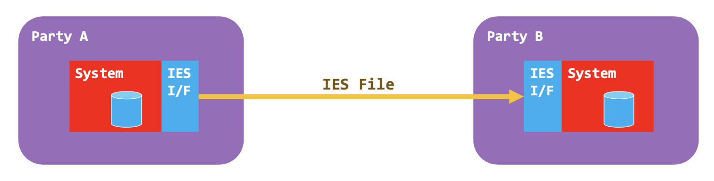

*I/F = shorthand for "interface"*

Systems continue to use their own internal data structures, but map to/from the IES format at the system boundary. The intention is to develop IES tooling at opensource to lower the bar to implementation.

---

## Usage: Synchronisation

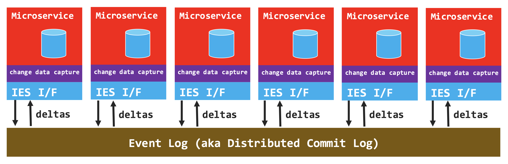

In a microservices architecture where there is extensive replication of data across services (bounded context principle), an event log is used to synchronise the services. Changes in data are written to the log, and picked up by services that subscribe to them. Use of data standards for the messages on the logs is essential to prevent unmanageable data variety.

A distributed commit log holds a sequence of data events (create, modify, delete) in strict temporal order. It allows applications and microservices to subscribe to a stream of events, triggering data events in their own databases and so keeping data synchronised across a wide range of applications and services. Apache Kafka is probably the most widely used.

---

## Usage: Storage

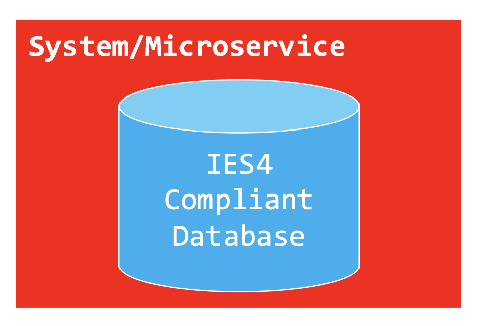

Although IES was not designed with storage in mind, there has been some interest in using it in that way, especially for applications which bring data together from many sources – i.e. the sink for a number of IES feeds. As IES is an RDF-based standard, the obvious database choice is a triplestore, but some teams have also been looking at implementing just the core IES concepts in document stores such as MongoDB.

Triplestores are graph databases that natively store data as sets of triples or “statements”. These are in the form of subject-predicate-object. As the triples refer to common subjects and objects, a network (or graph) of data is constructed – e.g. A likes B, B is-a Banana, A is-a Fruit-Fly

---

## Architecture

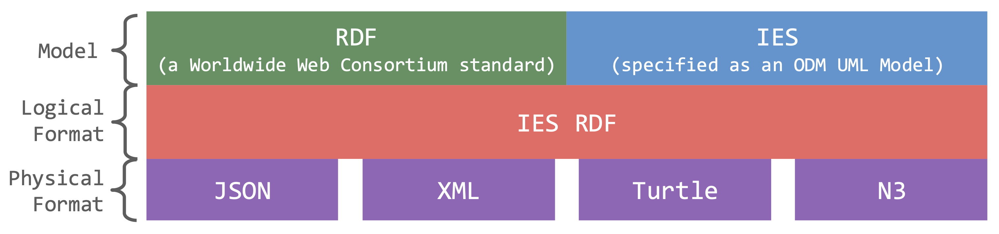

RDF tools and databases usually provide all the standard serialisation formats (e.g. RDF-JSON, JSON-LD, RDF-XML, etc.) so implementers are encouraged to work with these tools rather than writing their own serialisers/de-serialisers. Working at the logical RDF level rather than the physical format is easier and will result in better quality exchanges of data.

---

## Data Model Approach

The IES uses the W3C's RDF architecture so it doesn't have to worry about implementation – all that is already standardised. Instead, the IES specification concentrates on the data model (ontology). This is a logical model defining the types of things (elements) that can be exchanged, how those things can be related, and what properties they can have.

For example, IES specifies that there are people (`Person`) and there are locations (`Location`). It also says that people can have names, and that they can be in locations\*. This is all done using a diagram notation called UML**

\*Temporally – IES accounts for the fact that things can move.

**Strictly speaking, the ODM profile for UML is used (see [Model Notation](#model-notation) section).

---

## Model Overview

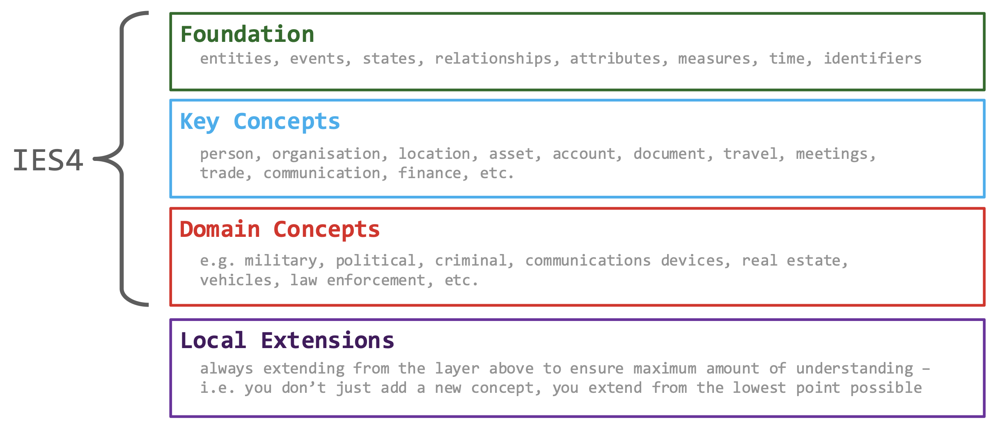

---

## Compositional Modelling Approach

IES differs from traditional data models in its compositional structure. The ontology consists of a limited set of reusable components that can be combined in various configurations to construct domain-specific models. This modular design enables flexibility: models can be modified incrementally without requiring comprehensive restructuring.

The comparison illustrated below demonstrates two modelling approaches: fixed-structure kits (such as Airfix) analogous to traditional schemas, versus modular building blocks (such as Lego) representing IES patterns. In IES, individual components can be added, removed, or modified independently whilst maintaining the integrity of the overall model.

\*Airfix is a UK model kit company – similar to Revell , Heller or Tamiya.

---

## Model Notation

The model is authored using the OMG’s ODM profile for UML. This allows us to export the model as RDF Schema, a Word document and a website all from one Sparx EA model.

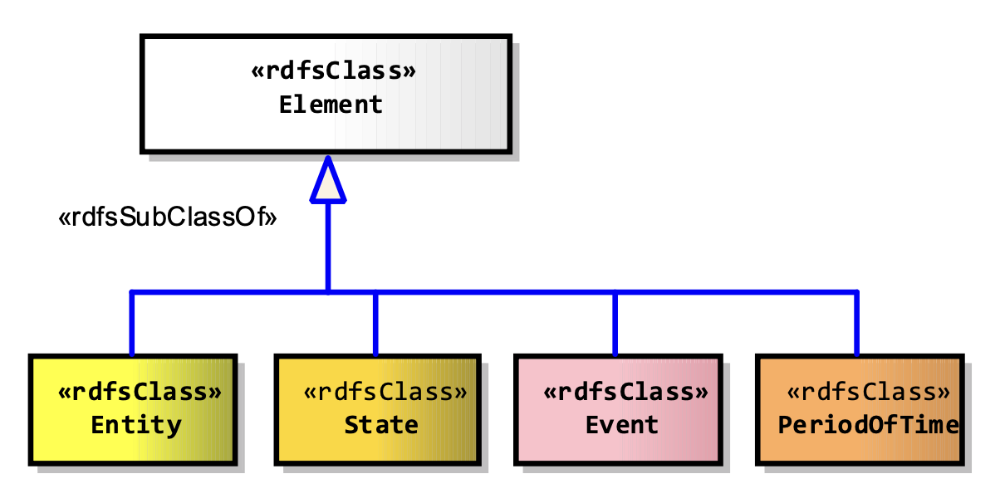

The ODM stereotypes (shown in chevrons <<*stereotype*>>) signify the underlying RDF Schema type – e.g Entity is an `rdfs:Class`. The colour coding that had been used in previous IES version was maintained – e.g. yellow for entities, pink for events, etc.

- OMG = Object Management Group (standards body)
- UML = Unified Modelling Language (published by OMG)
- ODM = Ontology Definition Metamodel (an extension to UML, published by OMG)

---

## RDF Overview

RDF is a standard format for graph data – i.e. data that is highly connected. The standard is published by the W3C, and is the UK Government
preferred data standard. It follows a structure of subject-predicate-object:

| Subject    | Predicate  | Object        |
| ---------- | ---------- | ------------- |
| Fred       | worksFor   | Acme          |
| Fred       | hasName    | "Fred Smith” |
| Acme       | inLocation | Birmingham    |
| Fred       | livesIn    | Coventry      |
| Coventry   | partOf     | UK            |
| Birmingham | partOf     | UK            |

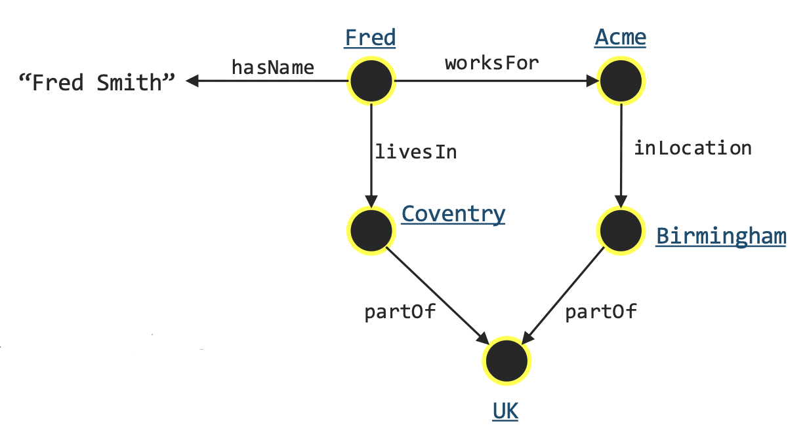

Readers familiar with RDF may proceed to the next section.
Key points:

1) This is a simplified example
2) It’s not IES compliant
3) The object can be a literal – in this case “Fred Smith”
4) The nodes need to be URIs (see next section)

---

## RDF URIs

- Nodes in an RDF graph have URIs (i.e. http://blah...)
- The edges (links) are typed by URIs too

| Subject                                                                                                             | Predicate                                                                                                                 | Object                                                                                                                |
| ------------------------------------------------------------------------------------------------------------------- | ------------------------------------------------------------------------------------------------------------------------- | --------------------------------------------------------------------------------------------------------------------- |
| [http://informationexchangestandard.org/example#Fred](http://informationexchangestandard.org/example#Fred)             | [http://informationexchangestandard.org/myOntology#worksFor](http://informationexchangestandard.org/myOntology#worksFor)     | [http://informationexchangestandard.org/example#Acme](http://informationexchangestandard.org/example#Acme) .             |
| [http://informationexchangestandard.org/example#Fred](http://informationexchangestandard.org/example#Fred)             | [http://informationexchangestandard.org/myOntology#hasName](http://informationexchangestandard.org/myOntology#hasName)       | “Fred Smith” .                                                                                                      |
| [http://informationexchangestandard.org/example#Acme](http://informationexchangestandard.org/example#Acme)             | [http://informationexchangestandard.org/myOntology#inLocation](http://informationexchangestandard.org/myOntology#inLocation) | [http://informationexchangestandard.org/example#Birmingham](http://informationexchangestandard.org/example#Birmingham) . |
| [http://informationexchangestandard.org/example#Fred](http://informationexchangestandard.org/example#Fred)             | [http://informationexchangestandard.org/myOntology#livesIn](http://informationexchangestandard.org/myOntology#livesIn)       | [http://informationexchangestandard.org/example#Coventry](http://informationexchangestandard.org/example#Coventry) .     |
| [http://informationexchangestandard.org/example#Coventry](http://informationexchangestandard.org/example#Coventry)     | [http://informationexchangestandard.org/myOntology#partOf](http://informationexchangestandard.org/myOntology#partOf)         | [http://informationexchangestandard.org/example#UK](http://informationexchangestandard.org/example#UK) .                 |
| [http://informationexchangestandard.org/example#Birmingham](http://informationexchangestandard.org/example#Birmingham) | [http://informationexchangestandard.org/myOntology#partOf](http://informationexchangestandard.org/myOntology#partOf)         | [http://informationexchangestandard.org/example#UK](http://informationexchangestandard.org/example#UK) .                 |

Namespace prefixes improves readability:

```turtle
@prefix ont: <http://informationexchangestandard.org/myOntology#> .
@prefix data: <http://informationexchangestandard.org/example#> .

data:Fred ont:worksFor data:Acme .
data:Fred ont:hasName “Fred Smith” .
data:Acme ont:inLocation data:Birmingham .
data:Fred ont:livesIn data:Coventry .
data:Coventry ont:partOf data:UK .
data:Birmingham ont:partOf data:UK .
```

The two examples above are valid RDF based on the N-Triples serialisation format. There are other standard ways to serialise RDF, including XML and JSON.

---

## RDF Schema

- Data schemas can be defined for RDF data using RDF-Schema (`rdfs`).
- RDF Schema is also defined using RDF.
- There are classes (`rdfs:Class`), relationship definitions (`rdf:Property`), subtype
  relationships (`rdfs:subClassOf`) and type-instance relationships (`rdf:type`)

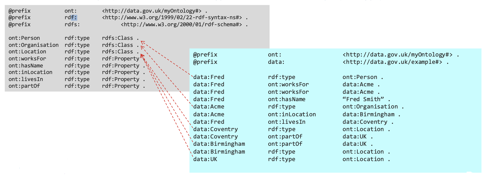

---

## More on Classes and Subclasses

- `rdfs:Class` – a concept of interest – e.g. Person, Location, etc.
- `rdfs:subClassOf` – a relationship between two `rdfs:Classes` that show one is a subclass of the other:

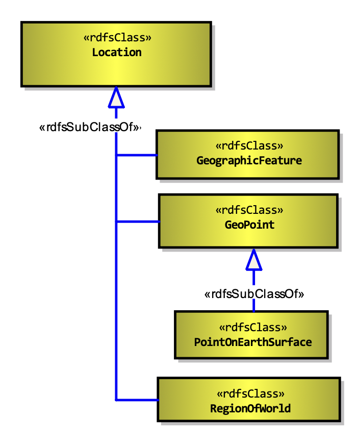

The subClassOf relationship between classes is like concentric classes in a Venn diagram. The members of each class are instances of exchanged IES data (e.g. Africa, North Pole, etc.)

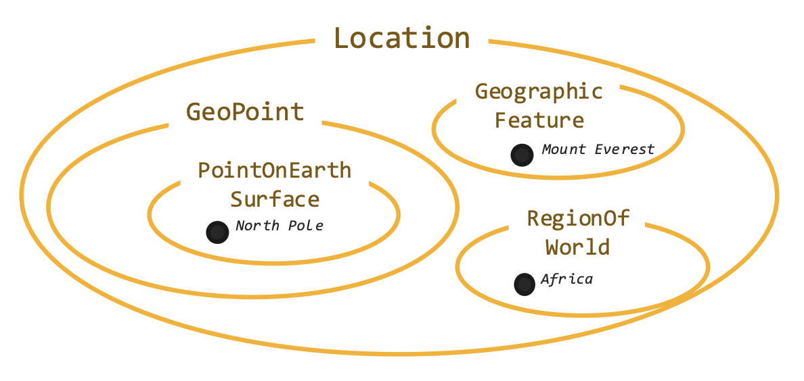

---

## Instance Notation

In developing the IES, a simple graphical notation for examples was required. RDF is a graph structure, so a nodes and links notation was the obvious choice. All IES nodes will be typed, and this can tend to clutter up the diagram, so the notation adopted indicates the type of each node using an abbreviation within the node. The colour coding from the model is carried through to the instance diagram – e.g. yellow outline = Entity.

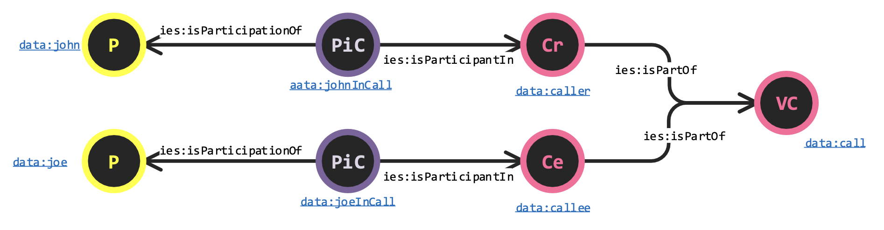

**Namespaces**

|               |                                                                                                                 |
| ------------- | --------------------------------------------------------------------------------------------------------------- |
| @prefix rdf:  | [http://www.w3.org/1999/02/22-rdf-syntax-ns#](http://www.w3.org/1999/02/22-rdf-syntax-ns#) .                       |
| @prefix rdfs: | [http://www.w3.org/2000/01/rdf-schema#](http://www.w3.org/2000/01/rdf-schema#) .                                   |
| @prefix ies:  | [http://informationexchangestandard.org/ont/ies/common/](http://informationexchangestandard.org/ont/ies/common/) . |
| @prefix data: | [http://informationexchangestandard.org/testdata#](http://informationexchangestandard.org/testdata#) .             |

**KEY:**

|     |                           |
| --- | ------------------------- |
| Ce  | ies:Caller                |
| Cr  | ies:Callee                |
| P   | ies:Person                |
| PiC | ies:PersonInCommunication |
| VC  | ies:VoiceCall             |

---

## RDF Serialisation Example

The example from the previous section serialised as RDF:

```turtle
@prefix         rdf:                    <http://www.w3.org/1999/02/22-rdf-syntax-ns#> .
@prefix         rdfs:                   <http://www.w3.org/2000/01/rdf-schema#> .
@prefix         ies:                    <http://informationexchangestandard.org/ont/ies/common/> .
@prefix         data:                   <http://informationexchangestandard.org/testdata#> .

data:john       a                       ies:Person .
data:joe        a                       ies:Person .
data:joeInCall  a                       ies:PersonInCall .
data:johnInCall a                       ies:PersonInCall .
data:caller     a                       ies:Caller .
data:callee     a                       ies:Callee .
data:call       a                       ies:VoiceCall .
data:johnInCall ies:isParticipationOf   ies:PersonInCall .
data:johnInCall ies:isParticipantIn     ies:Caller .
data:joeInCall  ies:isParticipationOf   ies:PersonInCall .
data:joeInCall  ies:isParticipantIn     ies:Callee .
data:caller     ies:isPartOf            data:call .
data:callee     ies:isPartOf            data:call .
```

**Note**: we’ve used “a” as a short-hand for “rdf:type”, which is allowed in some RDF serialisations.

---

## IES - Core Model Structure

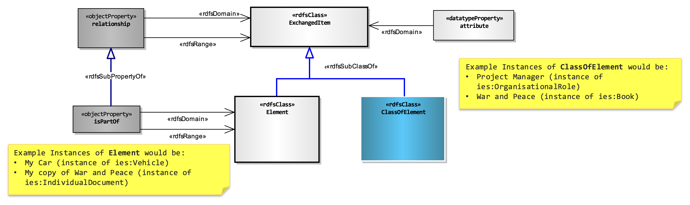

ExchangedItem is the broadest concept in IES (i.e. everything is an ExchangedItem) – these can have attributes and relationships. Elements are ExchangedItems that have physical extent (entities, events, states, etc.). As they are physical, there can be whole-part relationships (ies:isPartOf) between them. The ClassOfElement concept allows representation of non-physical concepts (i.e. classes of things).

---

## Space & Time

IES is a 4D model. Any instance of an IES Element will be something that occupies space and time. The 4D approach allows us to say things about temporal chunks (states) of these Elements. The approach goes further though – extent is the criterion for identity – if two things occupy precisely the same space at the same time, they are the SAME THING. Understanding this is the key to understanding IES.

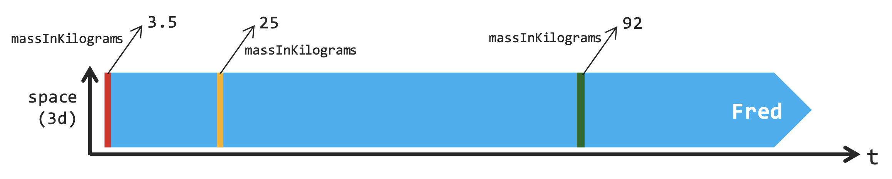

In the example above, Fred appears to have three different masses. However, each mass is associated with a different state of Fred – i.e. a different point in his life. Another notation  was introduced here – the space-time diagram.

*For more background on the 4D approach (formally, this is b-series four-dimensionalism), refer to:
“How Things Persist”, Katherine Hawley
“Developing High Quality Data Models”, Matthew West
“Business Objects: Re-engineering for Re-use”, Chris Partridge*

---

## Space-Time Diagrams

These are used a lot throughout this documentation so it’s worth going over the notation. Space (3D) is shown on the vertical axis – this is largely indicative rather than attempting to be precise. So, larger spatial items will be wider than smaller ones. Things that move in space over time will be diagonal, etc. Things that don’t move (relative to earth) will be horizontal.

Time is on horizontal axis. To represent periods of time, there will be vertical elements on the diagram (i.e. all of space for a period of time)

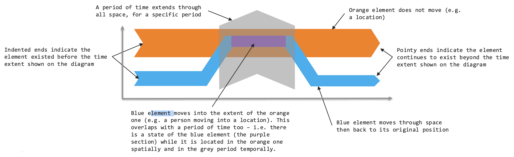

---

## IES Model – Elements

Elements are entities with spatio-temporal extent. More formally, they are things that occupy space and time. The space and time they occupy is known as their "four-dimensional extent".

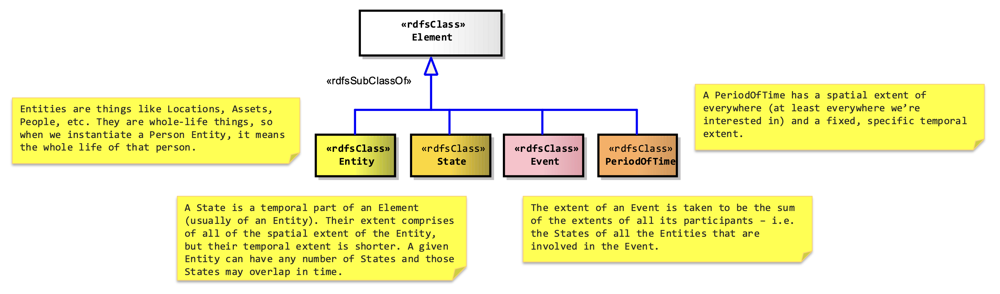

---

## Elements - Back to Fred

Using the instance notation from before, looking at just one of the states of Fred:

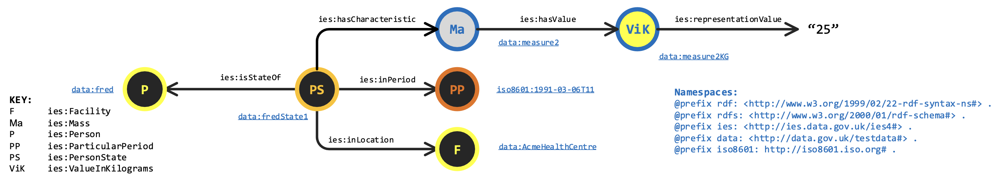

The example demonstrates several key components:

- The example includes a state of Fred (PS).
- The mass (Ma) is linked to the State using the hasCharacteristic relationship. The value of the mass (ViK) is then stated, and the numeric value (25) is assigned to it.
- The location of that particular State can be identified – in this case in a Facility (F) the Acme Health Centre.
- The time of that particular State can also be identified  – in this case it happened between 11:00 and 11:59 on 1992-03-06 as that’s the level of precision used in the ISO8601 date time. IES allows for very precise times and dates too, but this is just a simple example.

Thus, using just the States pattern, the location, time, and value of the mass measurement were identified.

---

## Applying the Pattern

The same pattern can be used over and over again – including to say where and when Fred was born…

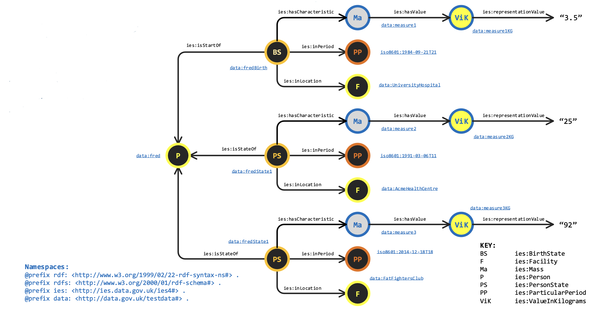

---

## 4D Fred

Each of the states is in a ParticularPeriod – each of an hour duration. This allows us to be vague about times – i.e. something happened somewhere in a ParticularPeriod. There are examples to follow where we’re more
specific.


---

## Event Modelling

The IES model has Events – i.e. activities. As the IES is pedantic about space and time, it's important to define Events that way too. In IES, the extent of a given Event is the sum of all its participations – i.e. the collections of states of things that were participating:

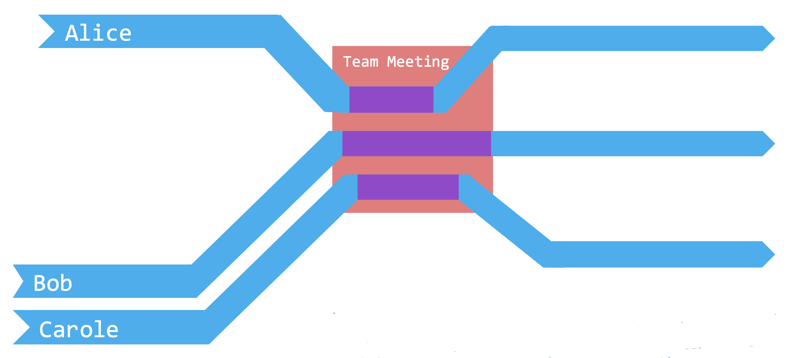

In the example above, each participant arrived and left at different times. Their states are their participations in the meeting, therefore the states are part of the meeting.

---

## Event Participant

`EventParticipants` are States that participate in Events

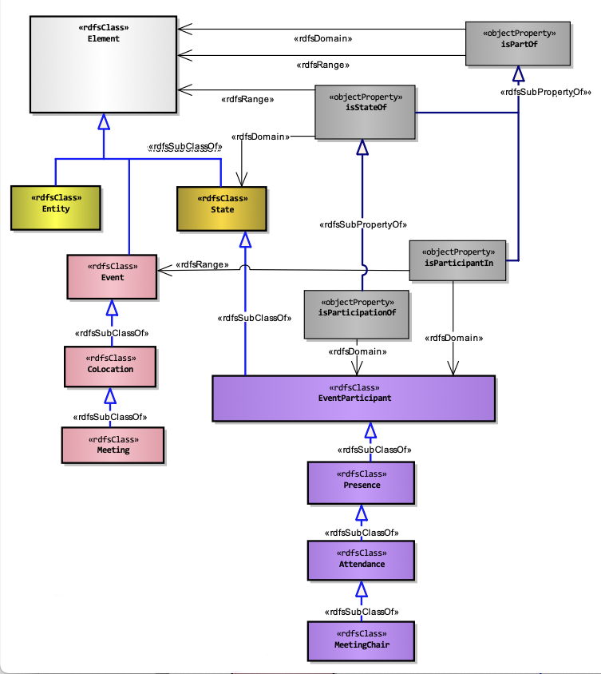

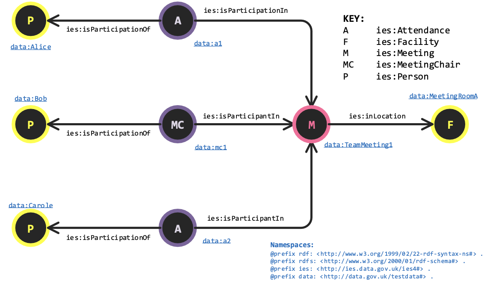

In this example, we’ve used subclasses of `EventParticipant` to show who was the meeting chair. The meeting location has also been added. As with the previous example (Fred’s weigh-ins) times could also be added (`ParticularPeriod`) for each participation, and indeed for the meeting itself.


Using this model, things can be recorded about a particular team meeting and its participants.


---

## Temporal Precision

Previous examples demonstrated how `Elements` can be in `ParticularPeriods`. This approach works well when dealing with imprecise time, but for representing precise starts and ends, the state model is required again - in this case, `BoundingState`:

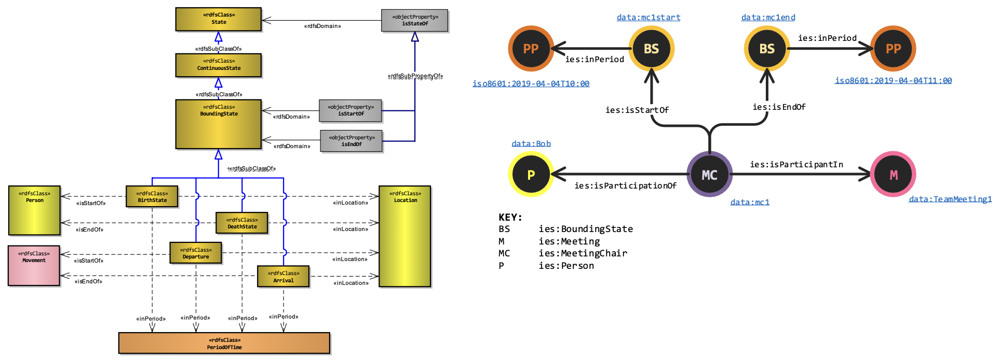

A `BoundingState` is a State which marks the temporal beginning or end of an Element. In the example above, the begin state is in the period 10:00 (the minute between 10:00 and 10:01) and the end is in 11:00. More precision can be achieved by adding seconds, fractions of seconds, etc. to the period.

---

## Bounding State

A `BoundingState` marks the beginning and end of `Elements` (in this case an `EventParticipant`)

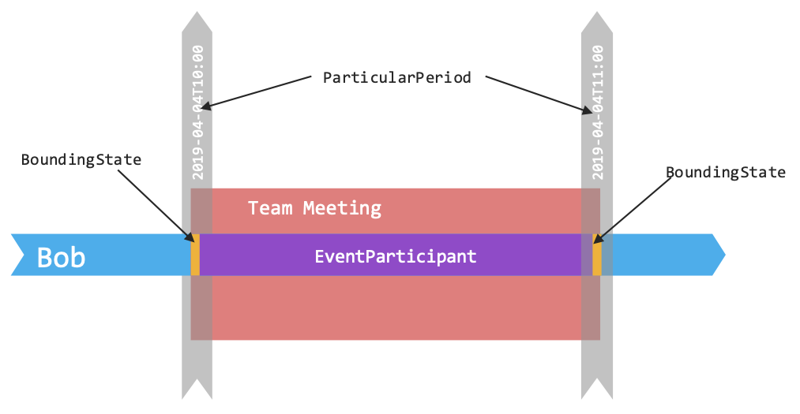

In the example above, there is a state of Bob (an `EventParticipant`) where he’s in the team meeting. To identify the start and end of the state, it is bounded with two `BoundingStates`. Each of those `BoundingStates` is in a `ParticularPeriod` (each a minute long) – i.e. the `EventParticipant` started some time during that minute.

**Note**: The meeting could be placed in the period 2019-04-04T10 (the hour from 10 to 11) but that doesn’t tell us when it started or finished, only that it started and finished in that hour period. The use of `BoundingStates` enables us to add more precision. Furthermore, the start time could be specified precisely, whilst leaving the end time imprecise.

---

## Temporal State Representations

The `BoundingState` spacetime diagram is made up from basic building blocks.

| Meaning                                               | Example                                                                                                       |
| ----------------------------------------------------- | ------------------------------------------------------------------------------------------------------------- |
| Started and finished within a given period            | 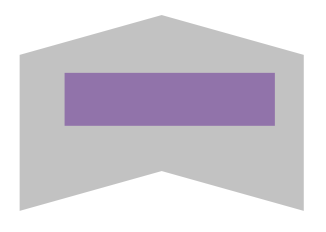                              |
| Started, don’t know when, still going                |              |
| Started, finished, don’t know when                   |                 |
| Started, finished, start time known, end time unknown |               |
| Started, finished, start time and end time known      | 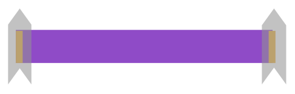 |

All of this is simple construction (mereology) applied to space and time. These simple building blocks can be used to build very complex temporal representations, but all of them are founded on a simple, re-usable logic.

---

## IES Time Elements

Periods of time are Elements in a 4D ontology. They can be treated like any other element, e.g. assembled with `isPartOf` relationships. This is the big advantage to a 4D ontology - time is treated the same way as space, which allows complex temporal logic information to be expressed using very simple constructs.

IES also allows a duration to be specified even when the precise start and end are not known, e.g. a meeting lasted an hour and took place on a particular day, but the precise start and end times are unknown.

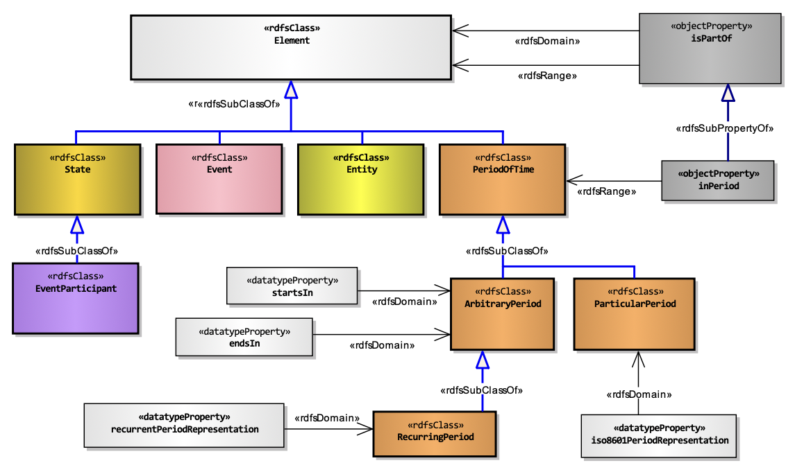

**Note:** to prevent duplicate periods being created, the uri of each period should reflect the ISO8601 datetime (encoded to % out the disallowed URI characters). So for example, the uri for January 2008 would be `http://iso8601.iso.org#2008-01`. For `ParticularPeriod`, this is fairly simple. For `PeriodOfTime`, the ISO8601 encoding for the period should be used.

### Key Relationships:

- `inPeriod` – links `Elements` to `PeriodOfTime`
- `startsIn` – datatype property for start datetime
- `endsIn` – datatype property for end datetime
- `recurrentPeriodRepresentation` – for recurring periods
- `iso8601PeriodRepresentation` – ISO8601 period encoding

---

## Locations

As well as saying when things happen, start and finish, the user should be able to say *where* they are. In the Fred example, there was a `Facility` (Acme Health Centre) as one of the locations:

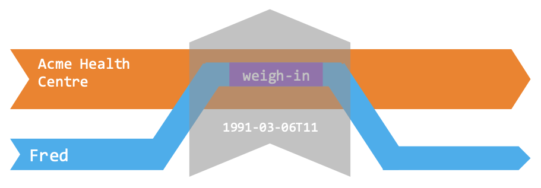

Locations can be countries, regions, facilities, or arbitrary land/sea parcels. Since IES v4.4.0, `ies:Location` formally aligns with the OGC GeoSPARQL standard as a subclass of `geo:Feature`, allowing geometries to be specified using standard formats including GeoJSON, WKT, GML, and KML with proper coordinate reference systems.

For example, a car park location can be represented as a polygon in the British National Grid system, serialised in either WKT or GeoJSON format, enabling precise spatial queries and analysis.

Combining the 4D modelling approach (states) with this spatial model gives us powerful capabilities to track and analyse how things (e.g. patients, deliveries, vehicles, forces) move through space and time.

---

## Quick Recap

Following the documentation thus far, IES building blocks enable the user to:

- Give details about things at certain times using states
- Say where something was using states and locations
- Say what was involved in Events using states (`EventParticipations`)
- Be vague or specific about the durations of things

All of this is done using the same, simple constructs that can be connected up to build quite complex pictures of how things change and move over time

# Names and Identifiers

## Information

When it comes to information – text, numbers, images, video, etc. information modelling presents particular challenges. The same image can exist in numerous places, and in numerous formats (digital, printed, etc.) The same goes for text – it’s important to distinguish between War and Peace and my copy of War and Peace. In most cases individual copies do not matter, but sometimes (e.g. in police evidence collection, cyber investigations, etc.) what happened to individual pieces of information is important. IES is very formal in how it relates the two concepts. In the example below, there are several copies of War and Peace. They all have in common that they are copies
of War and Peace, hence War and Peace is a class of which they are all members:

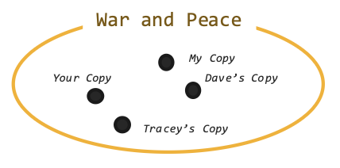

---

## Representation

Often, the information of interest is a representation of something in the real world. Robert Peel, a biography is a book. It is not the man himself. Similarly, there may be several copies of the book, and they’re all about Robert Peel. They were all written by Douglas Hurd too.

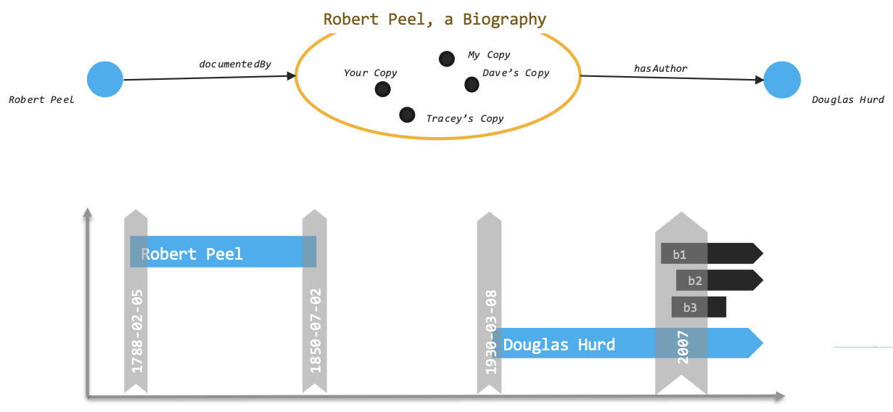

In space-time, Robert Peel existed long before any of the books (b1,b2,b3) which were published in 2007, and long before their author.

---

## Transitivity

Relationships are transitive if *A* being related to *B* and *B* being related *C* also means that *A* is related to *C*. Key examples of this in IES are `ies:isPartOf`, `ies:after` and `rdfs:subClassOf`.

- If *A* is part of *B*, and *B* is part of *C*, then *A* must also be part of *C*.
- If *Y* is after *X* and *Z* is after *Y* then *Z* must also be after *X*.
- If *Q* is a subclass of *P* and *R* is a subclass of *Q* then *R* must be a subclass of *P*

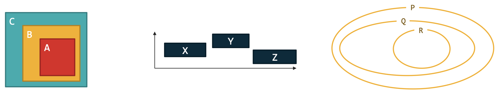

---

## Power types

To be able to talk about classes of documents and individual documents, the type levels up should be “pushed” up. So far in this documentation, the focus has been on `Elements` – things with spatio-temporal extent. These are the baseline for BORO ontologies, but it also allows for powertypes. Consider the (non-IES) trivial example below:

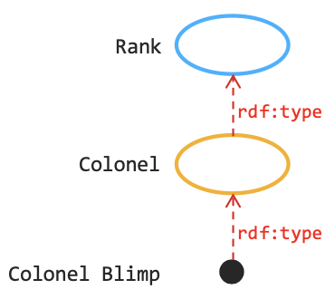

In this example, Colonel Blimp is an instance of (`rdf:type`) the class Colonel. Colonel is an instance of the class Rank. Colonel Blimp is not an instance of Rank though. `rdf:type` is therefore not transitive (see above on transitiviy).

The same thing can be achieved for documents:

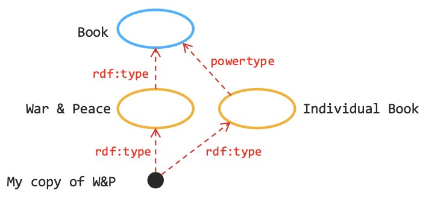

**Note**: The mechanism used for stepping up the type levels in IES is the `ies:powertype` relationship. It relates a Class to another class whose members are all possible subtypes of that Class. This is a bit of logical plumbing in IES and may not be of interest to all users. For readers interested in the formal logical foundations, start by looking up [“powerset” on Wikipedia](https://en.wikipedia.org/wiki/Power_set), followed by [Cantor’s theorem](https://en.wikipedia.org/wiki/Cantor%27s_theorem).

---

## Representations Types

There are three main types of representation – `Name`, `Identifier` and `WorkOfDocumentation`. Each can be used to represent any `ExchangedItem`.

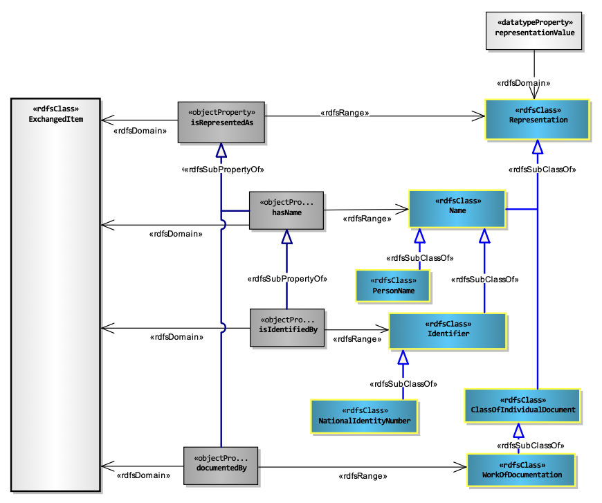

In the example below, Fred is called "Fred Smith" (all his life), but there is also a state of him where he had a national identity number. There are a number of subclasses of `Name` and `Identifier` used throughout IES.

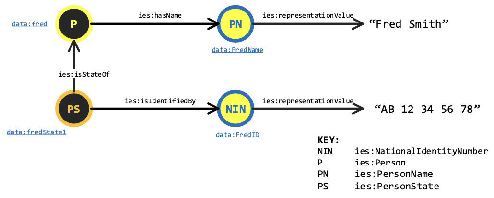

---

## Naming schemes

IES allows for multiple names and identifiers to be assigned to any given ExchangedItem. Use of states allows us to be specific about when those names and identifiers were valid. However, their origin must also be known – i.e. the organisation and/or system that uses them. This is done with Naming Schemes:

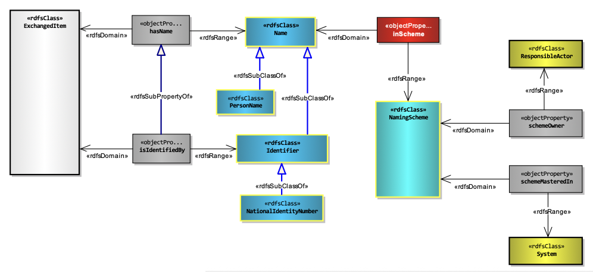

In the example below, Fred's ID is a National Insurance Number (naming scheme) and that scheme is owned by the DWP.

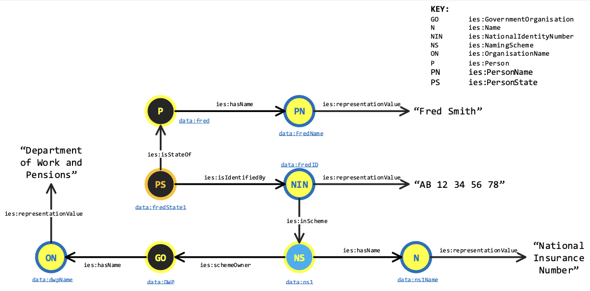

**Note**: the DWP, and even the naming scheme itself also have names.

---

## Hierarchies of Naming Schemes

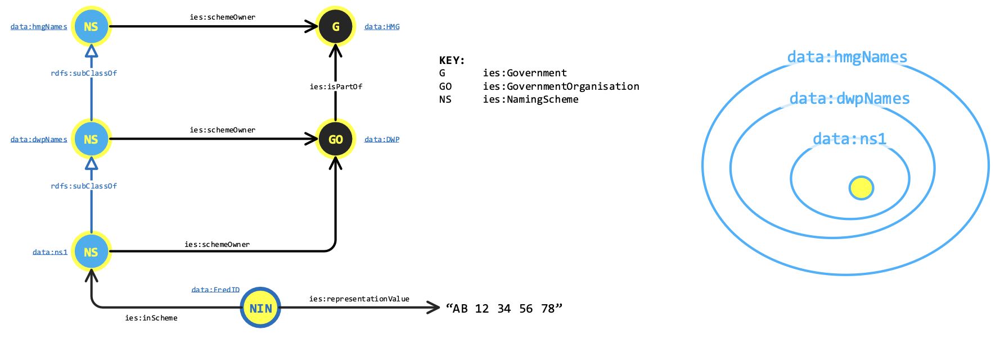

The naming schemes are classes and the names are instances of those classes. So…the naming schemes can be composed using subClassOf relationships… which are transitive. This means that the name in our example is also a DWP name and an HMG name.

---

## Quick recap - representation

- IES differentiates between things and their representations – e.g. a pipe and a picture of a pipe
- The same pattern is always used for representation
- Names (and identifiers) can be qualified using naming schemes
- Naming schemes can be associated with systems and/or organisations that use/own them
- Naming schemes can be organised into hierarchies

---

## Summary of Core Patterns

At this stage, the major building blocks for IES have been covered: things can be identified, their changes over time described, and their types specified. Interactions can be described, locations indicated, and temporal information provided to a chosen degree of accuracy whilst maintaining specificity about that accuracy.

All this is done using very simple, repeatable patterns that are also additive – i.e. the existing data doesn't need to be broken any further to add more information / detail. Those simple patterns probably cover 80% of the typical data requirements.

Like the major blocks in Lego&trade;, one can produce a reasonable model of anything that is requred using just these components. The rest of IES is about the more specialist blocks that allows the user to deal with the details.

---

## Worked Example - Fred in Hospital

### Introduction

Patients have names and NHS IDs. They go in and out of treatment, and stay in hospital beds in Wards.

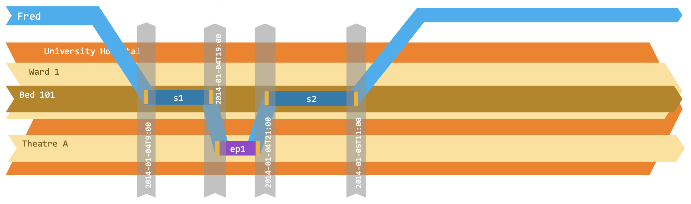

Fred arrives at 9:00 on 4/1 and is put in bed 101. He then goes into theatre at 19:00 and returns to bed 101 at 21:00. He is discharged at 11:00 the next day.

---

## Hospital Structure

The theatre and Ward are located in (part of) the Hospital. The bed is located in the Ward.

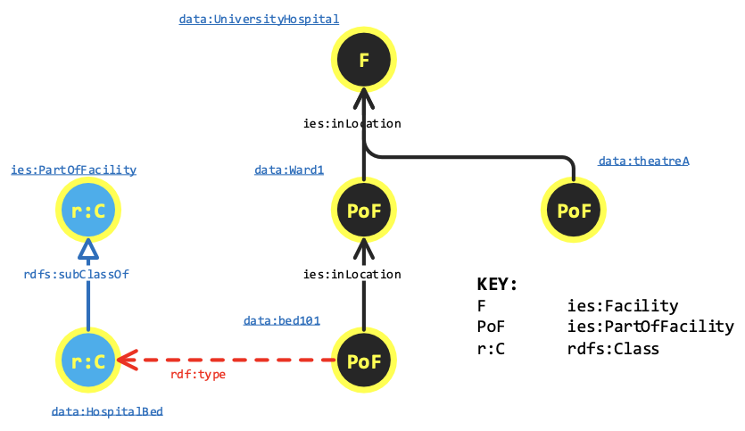

Two aspects should be noted. First, beds can move, but for simplicity the bed is modelled as always located in `Ward1`. Second, a model extension is used here. IES does not define facility components beyond `PartOfFacility`, therefore the model is extended to include `data:HospitalBed`.

---

## Fred's States

This section shows Fred’s movement around the hospital.

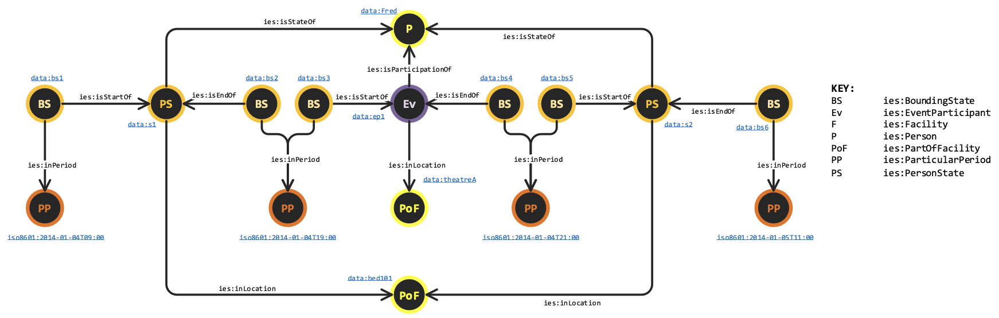

Three states (one is an EventParticipant), and each has start and end BoundingStates. The BoundingStates are in Particular Periods, and the PersonStates are in Locations.

---

## Complete Example

Notice we've added in the name and NHS number.

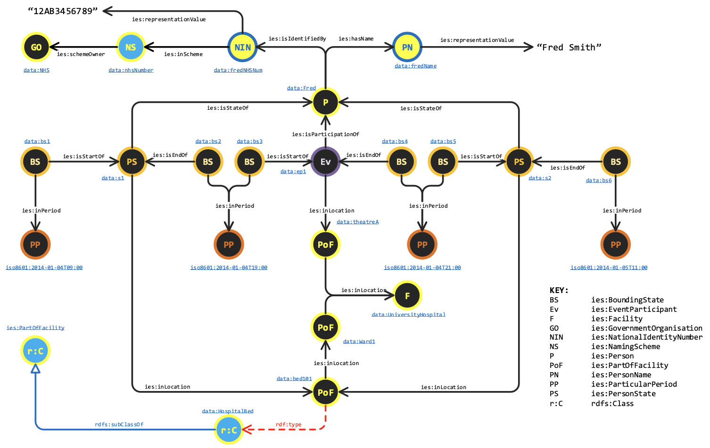

### Complete Example Serialized as N3

```turtle
@prefix rdf: <http://www.w3.org/1999/02/22-rdf-syntax-ns#> .
@prefix rdfs: <http://www.w3.org/2000/01/rdf-schema#> .
@prefix ies: <http://informationexchangestandard.org/ont/ies/common/#> .
@prefix data: <http://informationexchangestandard.org/testdata#> .
@prefix iso8601: <http://iso.org/iso8601#> .

data:NHS a ies:GovernmentOrganisation .
data:nhsNumber a ies:NamingScheme .
data:fredNHSNum a ies:NationalIdentityNumber .
data:Fred a ies:Person .
data:fredName a ies:PersonName .
data:s1 a ies:PersonState .
data:s2 a ies:PersonState .
data:bs1 a ies:BoundingState .
data:bs2 a ies:BoundingState .
data:bs3 a ies:BoundingState .
data:bs4 a ies:BoundingState .
data:bs5 a ies:BoundingState .
data:bs6 a ies:BoundingState .
data:ep1 a ies:EventParticipant .
iso8601:2014-01-04T09:00 a ies:ParticularPeriod .
iso8601:2014-01-04T19:00 a ies:ParticularPeriod .
iso8601:2014-01-04T21:00 a ies:ParticularPeriod .
iso8601:2014-01-05T11:00 a ies:ParticularPeriod .
data:theatreA a ies:PartOfFacility .
data:UniversityHospital a ies:Facility .
data:Ward1 a ies:PartOfFacility .
data:bed101 a ies:PartofFacility
data:bed101 a data:HospitalBed .
data:HospitalBed a rdfs:Class .
data:HospitalBed rdfs:subClassOf ies:PartOfFacility .
data:nhsNumber ies:schemeOwner data:NHS .
data:fredNHSNum ies:inScheme data:nhsNumber .
data:fredNHSNum ies:representationValue "12AB3456789" .
data:Fred ies:isIdentifiedBy data:fredNHSNum .
data:fredName ies:representationValue "Fred Smith" .
data:Fred ies:hasName data:fredName .
data:s1 ies:isStateOf data:Fred .
data:s2 ies:isStateOf data:Fred .
data:ep1 ies:isParticipationOf data:Fred .
data:bs1 ies:isStartOf data:s1 .
data:bs1 ies:inPeriod iso8601:2014-01-04T09:00 .
data:bs2 ies:isEndOf data:s1 .
data:bs2 ies:inPeriod iso8601:2014-01-04T19:00 .
data:bs3 ies:isStartOf data:ep1 .
data:bs3 ies:inPeriod iso8601:2014-01-04T19:00 .
data:bs4 ies:isEndOf data:ep1 .
data:bs4 ies:inPeriod iso8601:2014-01-04T21:00 .
data:bs5 ies:isStartOf data:s2 .
data:bs5 ies:inPeriod iso8601:2014-01-04T21:00 .
data:bs6 ies:isEndOf data:s2 .
data:bs6 ies:inPeriod iso8601:2014-01-05T11:00 .
data:ep1 ies:inLocation data:theatreA .
data:theatreA ies:inLocation data:UniversityHospital .
data:Ward1 ies:inLocation data:UniversityHospital .
data:bed101 ies:inLocation data:Ward1 .
data:s1 ies:inLocation data:bed101 .
data:s2 ies:inLocation data:bed101 .
```

### Complete Example Serialized as JSON-LD

```json
{
    "@context": { //this is the bit that maps the RDF constructs onto simple JSON keys
    "@base":"http://informationexchangestandard.org/testdata#",
    "name": "http://informationexchangestandard.org/ont/ies/common/hasName",
    "iso8601":"http://iso.org/iso8601#",
    "ies": "http://informationexchangestandard.org/ont/ies/common/",
    "rdfs": "http://www.w3.org/2000/01/rdf-schema#",
    "hasStates" : {"@reverse":"http://informationexchangestandard.org/ont/ies/common/isStateOf"}, //note reversal of predicate direction !!!
    "startState" : {"@reverse":"http://informationexchangestandard.org/ont/ies/common/isStartOf"},
    "endState" : {"@reverse":"http://informationexchangestandard.org/ont/ies/common/isEndOf"},
    "hasParticipations" : {"@reverse":"http://informationexchangestandard.org/ont/ies/common/isParticipationOf"}
    },
    "@graph": [
        {
            "@id": "Fred",
            "@type": "ies:Person",
            "ies:hasName": {
            "ies:representationValue": "Fred Smith“,
            "@id": "fredName",
            "@type": "ies:PersonName"
        },
        "ies:isIdentifiedBy": {
            "ies:representationValue": "12AB3456789",
            "@id": "fredNHSNum",
            "@type": "ies:NationalIdentityNumber",
            "ies:inScheme": {
                "@id": "nhsNumber",
                "@type": "ies:NamingScheme",
                "ies:schemeOwner":
                {
                    "@id": "NHS",
                    "@type": "ies:GovernmentOrganisation"
                }
            }
        },
        "hasStates": [
            {
                "@id": "s1",
                "@type": "ies:PersonsState",
                "ies:inLocation": {"@id":"bed101"},
                "startState": {
                    "@id": "bs1",
                    "@type": "ies:BoundingState",
                    "ies:inPeriod": {"@id": "iso8601:2014-01-04T09:00"}
                },
                "endState": {
                    "@id": "bs2",
                    "@type": "ies:BoundingState",
                    "ies:inPeriod": {"@id": "iso8601:2014-01-04T19:00"}
                }
            },
            {
                "@id": "s2",
                "@type": "ies:PersonsState",
                "ies:inLocation": {
                  "@id": "bed101"
                },
                "startState": {
                    "@id": "bs5",
                    "@type": "ies:BoundingState",
                    "ies:inPeriod": {
                      "@id": "iso8601:2014-01-04T21:00"
                    }
                },
                "endState": {
                    "@id": "bs6",
                    "@type": "ies:BoundingState",
                    "ies:inPeriod": {
                        "@id": "iso8601:2014-01-05T11:00"
                    }
                }
            }
        ],
        "hasParticipations": [
            {
                  "@id": "ep1",
                  "@type": "ies:EventParticipant",
                  "ies:inLocation": {"@id":"theatreA"},
                  "startState": {
                      "@id": "bs3",
                      "@type": "ies:BoundingState",
                      "ies:inPeriod": {"@id":"iso8601:2014-01-04T19:00"}
                  },
                  "endState": {
                      "@id": "bs4",
                      "@type": "ies:BoundingState",
                      "ies:inPeriod": {"@id":"iso8601:2014-01-04T21:00"}
                  }
            }
          ]},
          {
              "@id": "iso8601:2014-01-04T09:00",
              "@type": "ies:ParticularPeriod"
          },
          {
              "@id": "iso8601:2014-01-04T19:00",
              "@type": "ies:ParticularPeriod"
          },
          {
              "@id": "iso8601:2014-01-04T21:00",
              "@type": "ies:ParticularPeriod"
          },
          {
              "@id": "iso8601:2014-01-05T11:00",
              "@type": "ies:ParticularPeriod"
          },
          {
              "@id": "theatreA",
              "@type": "ies:PartOfFacility",
              "ies:inLocation": {
                  "@id": "UniversityHospital"
            }
          },
          {
              "@id": "Ward1",
              "@type": "ies:PartOfFacility",
              "ies:inLocation": {
                  "@id": "UniversityHospital"
              }
          },
          {
              "@id": "bed101",
              "@type": ["ies:PartOfFacility","HospitalBed"],
              "ies:inLocation": {"@id":"Ward1"}
          },
          {
              "@id": "HospitalBed",
              "@type": "rdfs:Class",
              "rdfs:subClassOf": {
                  “@id”: "ies:PartOfFacility“
              }
          },
          {
                "@id": "UniversityHospital",
                "@type": "ies:Facility"
          }
    ]
}
```

**Note**: JSON-LD sacrifices readability in order to provide a hierarchical structure. Note use of @reverse in the @context section – this allows some predicates to be reversed so the graph can be shaped into a JSON hierarchy for presentation as REST payloads, but re-assembled into a graph for RDF purposes.

---

© Crown Copyright 2020-2026 | Licensed under the MIT Licence
