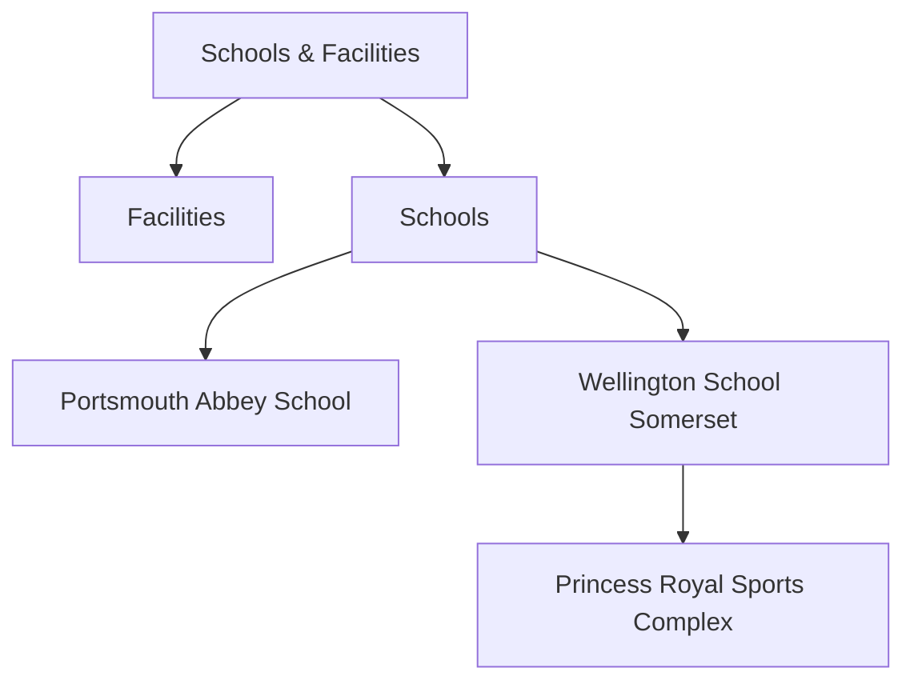
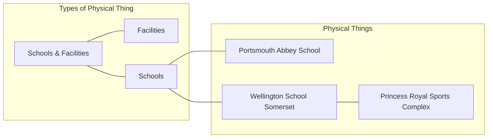
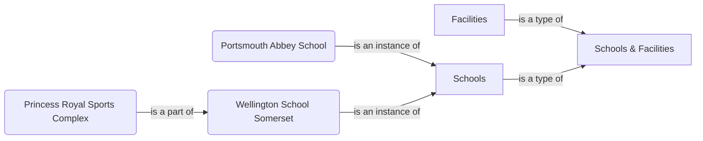
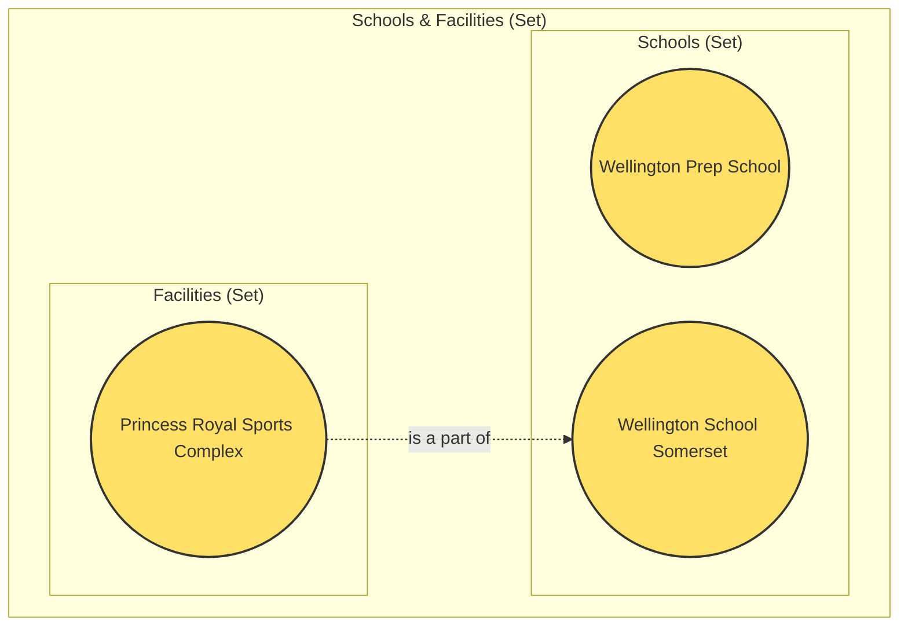

# What is an Ontology?

An **ontology** is a formal model of things we're interested in. It defines physical things, types of things, and relationships between them. But what makes it an ontology rather than just a data model or taxonomy?

## Table of Contents

- [The Formal Definition](#the-formal-definition)

  - [1. Mathematical Foundation](#1-mathematical-foundation)
  - [2. Consistent Conceptual Patterns](#2-consistent-conceptual-patterns)
  - [3. Repeatable Methodology](#3-repeatable-methodology)
- [IES&#39;s Approach](#iess-approach)
- [What an Ontology is NOT](#what-an-ontology-is-not)

  - [Not Just a Data Model](#not-just-a-data-model)
  - [Not Just a Taxonomy](#not-just-a-taxonomy)
    - [Taxonomy Characteristics](#taxonomy-characteristics)
    - [Example: UK Education System](#example-uk-education-system)
    - [Ontology&#39;s Enhancement](#ontologys-enhancement)
- [The Building Blocks Metaphor](#the-building-blocks-metaphor)
- [Why IES is an Ontology](#why-ies-is-an-ontology)
- [Key Takeaways](#key-takeaways)
- [Next Steps](#next-steps)

## The Formal Definition

To be taken seriously as an ontology, certain features must be in place:

### 1. Mathematical Foundation

A proper ontology must have underpinning in **formal logic** and/or **set theory**. This means the fundamental building blocks are based on sound mathematical and logical principles, not arbitrary design decisions.

### 2. Consistent Conceptual Patterns

Most serious ontologies have consistent ways to deal with common concepts:

- **Time**: How do we model things that change?
- **Location**: How do we describe where things are?
- **Properties**: How do we attach characteristics to things?
- **Relationships**: How do things connect to each other?

### 3. Repeatable Methodology

If the ontology is to be developed by more than one person, a repeatable methodology is essential. This ensures consistency and quality.

> ℹ️ **Info**: Building on Giants
> Defining these features from first principles is substantial work, so most ontologies re-use an existing **upper ontology**—a foundational model that others can extend.

## IES's Approach

For IES, we have:

- **Upper ontology**: IES Common (developed and extended and adapted from IDEAS)
- **Methodology**: inspired by BORO (Business Objects Reference Ontology)\*
- **Formal foundation**: Set theory and 4D extensional logic

This combination provides IES with a solid, proven foundation that has been successfully used in the Security, Defence, and National Policing domain. The IES is now being extended to other domains such as 'Environment' (building energy performance, and multi-modal transportation)
Whilst it all sounds very simple, using the BORO method is anything but simple. We are all rather wedded to our own terminologies and views of the world. Conducting a BORO analysis, especially as a committee, can be very challenging indeed. IES could not claim to be a full BORO ontology for this reason. Rather, it has been guided by the BORO approach, but still retains many of the concepts and structures from previous versions of IES.

## What an Ontology is NOT

Understanding what an ontology isn't helps clarify what it is.

### Not Just a Data Model

A **data model** defines the structure of some data storage system—a database or data file. Data models are often developed in three stages:

1. **Conceptual model**: Implementation-neutral specification of core concepts and relationships
2. **Logical model**: Adds rigour whilst remaining reasonably implementation-neutral
3. **Physical model**: Maps the logical model to specific storage mechanisms (tables, files, etc.)

**Key differences:**

| Aspect                  | Data Model              | Ontology                |
| ----------------------- | ----------------------- | ----------------------- |
| **Purpose**       | Structured data storage | Model real-world things |
| **Flexibility**   | Tied to implementation  | Implementation-agnostic |
| **Data vs Model** | Rigid separation        | Everything is data      |
| **Evolution**     | Costly to change        | Adapts easily ("lego")  |

An ontology is somewhat like a conceptual model, but one where the logical rigour of the logical data model is enforced by the modelling approach (it does away with the conceptual/logical split). Furthermore, an ontology is not confined to just types of information.

> 📋**Note**: Everything is Data
> The rigid divide between data model and data that drives traditional information systems development does not exist in an ontology—**everything is data**. This allows models to adapt and grow with minimal impact on implementation.

### Not Just a Taxonomy

A **taxonomy** is a hierarchical classification system. Like ontologies, taxonomies have hierarchies of classes (types of things). However, the difference lies in **rigour and purpose**.

#### Taxonomy Characteristics

- **Purpose**: Enable classification of information for discovery
- **Structure**: Dictated by making information easier to find
- **Relationships**: Works with words and "broader-narrower" relationships
- **Use case**: Filing system and search hierarchy

#### Example: UK Education System

Consider this example from the UK education system:

A taxonomy works with words, and the relationships between words. In this case, as we descend the tree, the words become narrower in terms of what they refer to. This works well as a filing system—we can systematically store and find information. However, it's not precise about the **nature** of these elements or their **real-world relationships**.

#### Ontology's Enhancement

An ontology is intended to be both computer and human interpretable – i.e. it requires a little more semantic and logical rigour. The first enhancement required is to work out the nature of the elements in the taxonomy. Some of these elements are types of things, whilst others are physical things. An ontology adds semantic and logical rigour. Let's analyse the same content ontologically:

Although the broader-narrower relationship between the words holds true, the relationships between the things in the real world to which those words refer is somewhat more varied:

*Portsmouth Abbey School* and *Wellington School Somersets* are both instances of Schools. *Facilities* is a type of *Schools & Facilities*. *Princess Royal Sports Complex* is part of *Wellington School Somerse*t. By being this specific, an ontology allows much more automated processing of information – e.g. counting the number of *Schools*, knowing that the *Sixth Form Centre* is located at Wellington are then computable, whereas that wouldn’t be possible with the less semantically rich broader-narrower relationships. Set theory diagrams (like Venn diagrams) are sometimes a convenient way to show concepts in an ontology:

The classes are shown as bounding boxes (sets) and the individual physical items as yellow circles. The `is-part-of` relationship is also shown bridging the sets. Developing a good ontology is all about identifying this level of detail and using solid logical principles to model the patterns that emerge.

**Nature of elements:**

- *Portsmouth Abbey School* and *Wellington School Somerset* → **Individual physical schools** (instances)
- *Schools* → **Type** (class of things)
- *Facilities* → **Type** (that is a sub-type)
- *Princess Royal Sports Complex* → **Individual physical facility** (instance)

**Real-world relationships:**

- *Portsmouth Abbey School* and *Wellington School Somerset* are **instances of** *Schools*
- *Facilities* is a **type of** *Schools & Facilities*
- *Princess Royal Sports Complex* **is part of** *Wellington School Somerset*

By being this specific, an ontology allows much more automated processing:

- Counting the number of Schools
- Knowing that the *Sixth Form Centre* is located at *Wellington School Somerset*
- Computing which facilities belong to which educational estates

These queries wouldn't be possible with less semantically rich "broader-narrower" relationships.

## The Building Blocks Metaphor

> 💡**Tip**: Thinking About Flexibility
> One way to understand the difference:

- **Data model** = Model aeroplane kit (can only be assembled one way; changing it requires serious re-engineering)
- **Ontology** = Interlocking building bricks (can be assembled into anything; changes are easy)
- **Taxonomy** = Guidebook to aeroplane components (helpful for finding parts, but not the thing itself)

This flexibility is why ontologies are particularly valuable for information exchange—they don't assume a specific implementation or use case.

## Why IES is an Ontology

IES qualifies as an ontology because it has:

1. **Formal foundation**: BORO's 4D extensional approach with set-theoretic basis
2. **Consistent patterns**: Standard ways to handle time, location, properties, relationships
3. **Implementation-agnostic**: Works with any RDF-compatible technology
4. **Everything is data**: Classes can be defined and extended in data payloads

## Key Takeaways

> ✅ **Success**: What Makes IES an Ontology

1. **Mathematical rigour**: Based on set theory and formal logic
2. **BORO methodology**: Consistent approach to identity and extent
3. **Semantic precision**: More specific than taxonomies, more flexible than data models
4. **Implementation freedom**: Not tied to any specific storage technology
5. **Extensible**: Everything is data, so the model can grow organically

## Next Steps

The following topics may be explored now that an understanding of ontology has been established:

- [**The BORO Method**](boro-methodology.md): How BORO's approach shapes IES

## References

###### The IES Philosophy

> "An ontology is an extensible model of the things we're interested in. Formal ontologies provide a set of fundamental components which can be extended to particular domains, and connected together using standard patterns of business logic."

---

*© Crown Copyright 2020-2026*
